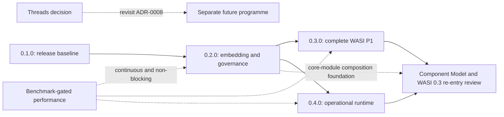

# Roadmap review — 2026-08-15

## Decision summary

Release the completed pinned-Core-3 runtime as `0.1.0` before beginning the
post-v1 feature programme.

The review settled the sequence. Release publication was authorized separately
through `create-release` on 2026-08-15. Milestone, issue, Component Model, and
threads work remains separately confirmation-gated.

## Evidence snapshot

- Project source: [`frostney/wasmlight@3fa8069`](https://github.com/frostney/wasmlight/tree/3fa80699d15c0d9768a966a250018a8e22a7c78d),
  the fetched remote default on 2026-08-15.
- Forge: seven merged pull requests; no open pull requests, issues,
  milestones, tags, or releases.
- Exact-main verification: [CI run 31899074165](https://github.com/frostney/wasmlight/actions/runs/31899074165)
  passed on x86-64 Windows, i386 Windows, AArch64 macOS, AArch64 Linux,
  x86-64 macOS, and x86-64 Linux. The four 64-bit UNIX legs proved
  interpreter/JIT/AOT tally identity; the Windows legs proved the interpreter.
- Core-domain metric: the pinned 257-script Core 3 corpus is 65,188 pass,
  zero fail, zero skip, and zero staged in every applicable tier.
- Performance metric: the CI-published runtime-comparison artifacts from PRs
  #5, #6, and #7 were used. Cross-run values are directional because hosted
  runners vary; only same-runner base-versus-candidate comparisons establish a
  particular PR's effect.
- Direction and constraints: [VISION.md](VISION.md), [CONTEXT.md](CONTEXT.md),
  [docs/roadmap.md](docs/roadmap.md), the [architecture decisions](docs/adr/),
  and the project's readiness and completion gates.

Peer source heads inspected for feature presence:

| Runtime | Source head | Product role in this review |
| --- | --- | --- |
| wasmlight | [`3fa8069`](https://github.com/frostney/wasmlight/tree/3fa80699d15c0d9768a966a250018a8e22a7c78d) | Subject: native Object Pascal, pinned Core 3, one validated IR and three tiers |
| Wasmtime | [`bc2f967`](https://github.com/bytecodealliance/wasmtime/tree/bc2f967927f9f0e839095a752bf554c4a09fdd13) | Production, standards, resource-control, and performance ceiling |
| Wasmer | [`989c591`](https://github.com/wasmerio/wasmer/tree/989c591d187c0d67b64d116196585627b85bbc20) | Compiler choice, async embedding, metering, and WASIX breadth |
| WasmEdge | [`ba7328a`](https://github.com/WasmEdge/WasmEdge/tree/ba7328af264276bac3398154bf4ac87b416084cf) | Three-mode CLI, operational controls, plugins, and experimental Components |
| WAMR | [`eb06091`](https://github.com/bytecodealliance/wasm-micro-runtime/tree/eb06091c4587a93c0ba1253566d6d4ad252633b1) | Embedded portability, configurable tiers, debugging, and broad WASI |
| wazero | [`3ab4217`](https://github.com/tetratelabs/wazero/tree/3ab421731a94caa7f407973ee689385707f7af81) | Language-native embedding, cancellation, caching, traces, and broad WASI P1 |
| wasm3 | [`8815edc`](https://github.com/wasm3/wasm3/tree/8815edc280e6fb039dbdc40dbb4cdebd20d769f5) | Tiny interpreter and constrained-host reference |

Source presence is not treated as proof that peers pass wasmlight's pinned
corpus or that every configurable peer feature works in every combination.

## Current-state correction

The original A–J roadmap is delivered and should remain the historical record
of how the runtime reached v1 scope. Its current summary has two stale claims:

1. It says the repository has no merged-PR history. Seven pull requests have
   now merged.
2. It says several full-matrix CI legs have never run. Exact-main CI has now
   passed all six configured platform and architecture legs.

All existing work is unreleased. `lwpt.toml` already names `0.1.0`, while
`CHANGELOG.md` still contains only an empty Unreleased section. The immediate
roadmap boundary is therefore a first release, not another core-runtime track.

## Source-verified capability classification

Only Partial or Absent capabilities are candidates for future releases.

| Capability | State | Source evidence | Roadmap treatment |
| --- | --- | --- | --- |
| Pinned Core 3 execution | Done | Core corpus and three-tier identity are green | Preserve as a gate; do not reschedule |
| Interpreter, JIT, and AOT implementations | Done | `Wasm.Interp`, `Wasm.Jit`, and `Wasm.Aot` ship | Preserve as interchangeable tiers |
| Production JIT selection | Partial | `RegisterJit` installs the hook, but callers own compilation and ordinary `run` uses interpreter or a supplied AOT artifact | `0.2.0` runtime policy |
| Public embedding entity coverage | Partial | `TWasmLinker` defines functions, memories, and globals; table and tag imports are rejected | `0.2.0` embedding completion |
| Instance-to-instance composition | Absent | The facade has no operation that publishes one instance's exports as another module's imports | `0.2.0` embedding completion |
| WASI Preview 1 | Partial | `WasiDefineAll` registers 23 functions; the standard long tail is undefined | `0.3.0` host completion |
| External WASI conformance | Absent | `wasi-testsuite` is documented but not wired | First `0.3.0` implementation slice |
| Resource governance | Partial | Epoch interruption exists; there is no cohesive public limiter for store entities or memory/table growth | `0.2.0` runtime policy |
| Async host calls | Absent, intentionally deferred | Host callbacks and invocation are synchronous | Design once with the selected Component Model and WASI async target |
| Operational observability | Partial | IR inspection exists; source-aware stacks, DWARF, coredumps, profiler maps, and structured statistics do not | `0.4.0` |
| Component Model and WASI 0.2/0.3 | Absent, deferred | No component decode, validation, instantiation, or Canonical ABI | Post-`0.4`, gated by a new ADR |
| Threads and shared memory | Absent, intentionally excluded | The decoder rejects shared-memory flags and ADR-0008 confines a store to one thread | Separate future programme requiring an ADR reversal |
| Native compiled tiers beyond 64-bit UNIX | Absent | `WASM_JIT_EXEC` is limited to AArch64/x86-64 UNIX | Demand-led; not a conformance gap |
| Post-Core-3 proposals | Absent | Threads, custom descriptors, custom page sizes, wide arithmetic, and stack switching remain outside the pin | Require an explicit target/pinning decision |

### Public embedding gap

[`TWasmLinker`](https://github.com/frostney/wasmlight/blob/3fa80699d15c0d9768a966a250018a8e22a7c78d/source/units/Wasm.Engine.pas#L152-L213)
stores only function, memory, and global definitions. Its
[`ResolveImports`](https://github.com/frostney/wasmlight/blob/3fa80699d15c0d9768a966a250018a8e22a7c78d/source/units/Wasm.Engine.pas#L612-L679)
path rejects table and tag imports. The engine supports those entity kinds
internally, so this is a facade gap rather than missing Core behavior.

The complete embedder needs:

- table and tag definition with exact import-type matching;
- table and tag export lookup;
- a supported way to publish an instance's exports into the linker;
- lifetime rules that keep store ownership and module borrowing explicit;
- negative tests proving undefined and incompatible imports remain link
  errors, not ambient fallbacks.

This foundation also removes an avoidable obstacle for a future Component
Model implementation, which must compose multiple core modules.

### WASI Preview 1 gap

[`WasiDefineAll`](https://github.com/frostney/wasmlight/blob/3fa80699d15c0d9768a966a250018a8e22a7c78d/source/units/Wasm.Wasi.pas#L2474-L2528)
registers 23 functions. Compared with the complete standard registration
surface in
[`wazero`](https://github.com/tetratelabs/wazero/blob/3ab421731a94caa7f407973ee689385707f7af81/imports/wasi_snapshot_preview1/wasi.go#L181-L226),
the omitted non-socket functions are:

- `fd_advise`, `fd_allocate`, `fd_datasync`, `fd_fdstat_set_flags`,
  `fd_fdstat_set_rights`, `fd_filestat_set_size`, `fd_filestat_set_times`;
- `fd_pread`, `fd_pwrite`, `fd_renumber`, `fd_sync`, and `fd_tell`;
- `path_filestat_set_times`, `path_link`, `path_readlink`, `path_rename`, and
  `path_symlink`;
- `poll_oneoff` and `proc_raise`.

The four socket imports are `sock_accept`, `sock_recv`, `sock_send`, and
`sock_shutdown`. They remain a separate capability-policy decision and do not
block completing the 19 non-network functions.

The upstream [`wasi-testsuite`](https://github.com/WebAssembly/wasi-testsuite)
must land before the long-tail implementation so the project does not grade
its own host behavior. Existing hermetic tests remain responsible for injected
clock, entropy, streams, preopen containment, and OS-specific negative paths.

### Execution policy and governance gap

[`RegisterJit`](https://github.com/frostney/wasmlight/blob/3fa80699d15c0d9768a966a250018a8e22a7c78d/source/units/Wasm.Jit.pas#L171-L183)
installs the compiled-entry hook, while `ForceCompile` remains caller-owned.
The ordinary run path exposes interpreter execution and supplied AOT artifacts,
not a runtime-owned JIT policy. A future policy must preserve the vocabulary:
tier selection is per function and remains the runtime's decision.

The host also needs explicit resource governance. Epoch interruption is
already the cancellation mechanism and must not be relabelled as fuel. A
resource-policy object should cover aggregate memories, tables, instances,
growth ceilings, and interruption configuration without moving spec limits
out of validation or adding synchronization to the thread-confined store.

### Observability gap

`inspect`, validation reporting, IR disassembly, and benchmark instrumentation
are useful developer tools. They do not yet provide the operational facilities
present in larger peers:

- module/name-section-aware guest stack traces;
- optional DWARF source resolution;
- profiler maps for generated code;
- structured per-store or per-instance statistics;
- coredumps or debugger integration.

This work should consume the existing activation stack, tier seam, and IR
metadata. No execution tier may invent a different call-stack model.

### Component Model re-entry check

ADR-0014's conclusion still holds, but its upstream facts need refreshing.
At current
[`WebAssembly/component-model@4142913`](https://github.com/WebAssembly/component-model/tree/4142913deca2cb162925c95cbffc904a93a3bdf6),
the project has a growing WAST suite, while a formal specification and
reference interpreter remain future work. The current Canonical ABI still uses
`realloc`; lazy lowering remains a future improvement. WASI 0.3 has also been
ratified, so a future re-entry review must choose a current target rather than
assuming WASI 0.2.

The Component Model therefore gets an investigation milestone only after a
new ADR demonstrates:

1. a pin that makes the target reproducible;
2. an independent enough conformance oracle for the project's standards bar;
3. a stable Canonical ABI target rather than an implementation known to be
   superseded;
4. a Component/WASI capability model that remains deny-by-default.

Threads do not share this track. They require a separate shared-memory design
and explicit reconsideration of ADR-0008.

## Delivery evidence and confidence

### Throughput

- 90-day merged-PR count: 7, or 0.54 per week.
- Repository-age-adjusted rate: approximately 3.1 per week.
- Active merge burst: seven PRs in 68 hours, approximately 17.3 per week.
- Issue-created-to-merged lead time: unavailable because no implementation PR
  closes an issue.
- Flagged fallback, PR-opened-to-merged: 25.1-minute median and 69.7-minute
  mean.

The fallback excludes most investigation and implementation: the merged PRs
range from 205 to 5,011 additions and from four to 39 changed files. A PR is
not yet a stable unit of capacity. Dates would therefore be invented.

The plan should be re-anchored after four issue-linked roadmap PRs have merged.
That gives the project its first issue-created-to-merge sample and tests
whether the proposed bounded slices are actually comparable.

### Performance slope

Across the earliest and latest comparable CI artifacts:

| Linux x86-64 workload | Earlier median | Current median | Direction |
| --- | ---: | ---: | ---: |
| loop | 861.7 ms | 737.5 ms | 14.4% faster |
| recursive Fibonacci | 969.6 ms | 74.3 ms | 92.3% faster |
| varying-address memory | 284.9 ms | 232.5 ms | 18.4% faster |
| startup | 1.92 ms | 2.69 ms | too noisy to classify |

On the latest Linux x86-64 artifact, wasmlight was approximately 1.15x
Wasmtime on Fibonacci, 2.02x on the loop, 3.71x on generic calls, 5.74x on
varying-address memory, and 5.53x on SIMD. Startup and the host-call workload
were faster than Wasmtime in that run. These are workload, version, tier, and
runner-specific observations, not a general runtime ranking.

Performance remains a continuous benchmark-gated track. It does not block a
feature release unless that release regresses its own same-runner baseline or
violates tier identity.

## Version plan

### `0.1.0` — pinned-Core-3 baseline

Size: one bounded release-preparation PR.

- Correct roadmap and testing documentation to current forge and CI truth.
- Generate and commit the first changelog section.
- Run the release gate on the exact release commit.
- Publish through the repository's `create-release` workflow; that separate
  authorization was given on 2026-08-15.
- Add no new runtime behavior.

Exit: an unprefixed `0.1.0` tag matching `lwpt.toml`, with the complete pinned
Core 3 implementation and current WASI subset stated accurately.

### `0.2.0` — complete and governable embedding

Size: six to eight bounded implementation PRs.

- Table and tag definitions, import resolution, and export lookup.
- Instance-to-instance linking through the public facade.
- Host-owned resource-policy configuration and aggregate limits.
- Public epoch cancellation configuration.
- Explicit per-function tier policy and normal JIT integration.
- Embedding documentation and negative-path coverage.

Longest pole: entity lifetime and type compatibility across linked instances
without weakening store ownership or validation-once.

### `0.3.0` — complete, independently judged WASI Preview 1

Size: six to nine bounded implementation PRs.

- Wire `wasi-testsuite` before implementing the long tail.
- Complete positional I/O, synchronization, allocation, and metadata calls.
- Complete link, rename, symlink, and readlink operations under preopens.
- Add `poll_oneoff` and the remaining non-network process behavior.
- Decide reactor handling explicitly.
- Exclude sockets from `0.3.0`; track them as a later, separately approved
  capability slice using pre-granted socket handles.

Longest pole: identical filesystem and containment behavior across POSIX and
Windows.

### `0.4.0` — operational runtime

Size: three to five bounded implementation PRs.

- Add name-aware guest stack traces.
- Add profiler/JIT-map integration and structured runtime statistics.
- Investigate DWARF, coredump, and debugger increments separately.
- Add compiled platforms only in response to demonstrated demand.
- Keep host calls synchronous; do not create a suspension mechanism ahead of
  the Component Model target.

Longest pole: deriving one accurate diagnostic call stack across interpreted
and compiled frames without changing trampoline or tier behavior.

### After `0.4.0`

- Re-run the Component Model re-entry review against current upstream.
- Design async hosting once, with the selected Component Model and WASI async
  ABI, so core embedding and Components do not grow competing suspension
  mechanisms.
- Once the re-entry gate is met, make the Component Model and current WASI
  generation the next strategic standards programme.
- Keep threads as a distinct, demand-led architectural programme.
- Adopt post-Core-3 proposals only under an explicit conformance-target and
  pinning decision. Wide arithmetic is the smallest likely investigation, but
  it does not silently extend the Core 3 claim.

## Dependency shape

## Timeline sensitivity

The counted near-term plan is approximately 16 to 23 bounded PRs. Applying the
available rates produces:

| Basis | Implied duration | Confidence |
| --- | ---: | --- |
| 90-day rate | 30–43 weeks | Distorted because the repository did not exist for most of the window |
| Repository-age rate | 5–7.5 weeks | Low; mixes direct-to-main history with the recent PR burst |
| Active 68-hour burst | 0.9–1.3 weeks | Not sustainable evidence |

The spread is the result: no dated Gantt is supportable. Releases are sequenced
by dependency and exit criteria until issue-linked lead-time evidence exists.

## Decisions

### Accepted

1. **Release `0.1.0` before feature expansion.** The v1 core is delivered and
   exact-main CI is green. Peer gaps become versioned post-release work rather
   than blockers for the baseline.
2. **Keep Preview 1 sockets out of `0.3.0`.** Complete the 19 non-network
   functions and `wasi-testsuite` first. Any later socket implementation must
   be an opt-in capability over pre-granted socket handles, retain the standard
   `wasi_snapshot_preview1` import namespace, and receive its own review.
3. **Defer async hosting to the Component Model re-entry.** Nothing in
   `0.2.0` through `0.4.0` requires suspension. The runtime will design one
   mechanism against its selected Component Model and WASI async ABI instead
   of creating a standalone callback protocol that may have to coexist with or
   be replaced by that model.
4. **Make the Component Model and current WASI generation the next strategic
   standards programme once the re-entry gate is met.** It builds on the
   embedding and host work in `0.2.0` and `0.3.0`. Threads remain demand-led
   because they reverse ADR-0008, and isolated post-Core-3 proposals provide
   less product leverage.

### Remaining decision boundary

No roadmap-level sequencing decision remains open. Each release still needs
its own investigated issues and implementation decisions, and Component Model
work cannot begin until a fresh re-entry review proves that ADR-0014's gate is
met.

## Release cadence

- Cut one pre-1.0 minor per coherent capability theme.
- Use patch releases for correctness, conformance, security, and tier-identity
  fixes.
- Require exact-head full CI before every release.
- Keep performance measurements informational and same-runner; never turn
  absolute benchmark numbers into CI thresholds.
- Create milestones and issues only after the corresponding scope and pending
  decisions are confirmed.
