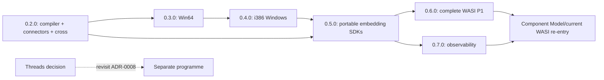

# Roadmap review — 2026-08-24

## Decision summary

The approved roadmap makes native application compilation the next product
spine. `wasmlight compile` produces a complete native executable: every guest
function is compiled ahead of time or compilation fails, and the output
contains neither the interpreter nor the JIT compiler.

The programme runs from `0.2.0` through `0.7.0`:

1. strict native compilation, connectors, cross-compilation, and Homebrew;
2. Win64 native compilation;
3. i386 Windows native compilation;
4. portable C, Nim, C#, Rust, Go, and Python embedding SDKs;
5. independently judged non-network WASI Preview 1; and
6. operational observability.

This plan was explicitly approved on 2026-08-24. It replaces the post-`0.1.0`
sequence in the 2026-08-15 review; it does not change the historical A–J record
in `docs/roadmap.md`.

## Evidence snapshot

- Source: `frostney/wasmlight@0d0c8ffd79067bae85b9d8d927cfab7c9b558753`,
  exact fetched `origin/main` on 2026-08-24.
- CI: exact-main run 32737294593 passed across the six governed targets.
- Forge before roadmap record creation: one published release (`0.1.0`), no
  milestones, three issues (one open), no open pull requests, and 24 merged
  pull requests.
- Throughput: 24 merges in the 90-day window, or 1.87/week over the full
  window and 13.9/week over the repository's short active history.
- Issue lead time: only two issue-linked deliveries exist, at 52 and 196
  minutes from issue creation to merge. That sample is too small for dates.
- Core conformance: the pinned 257-script corpus remains 65,188 pass, zero
  fail, zero skip, and zero staged on every applicable tier.
- Peer comparison: Wasmtime, Wasmer, WasmEdge, WAMR, wazero, and wasm3 remain
  useful references for production embedding, AOT distribution, platform
  breadth, host integration, resource governance, and observability. Presence
  in peer source is not treated as proof of equivalent conformance.

## Source-level classification

Only Partial or Absent capabilities are scheduled.

| Capability | State | Current source evidence | Treatment |
| --- | --- | --- | --- |
| Pinned Core 3 execution | Done | Interpreter/JIT/AOT corpus identity | Preserve as a release gate |
| AOT artifact cache | Done | `Wasm.Aot` and `.waot` load guards | Preserve for runtime use |
| Strict whole-module AOT | Partial | `AotCompileModuleIr` records declined functions | `0.2.0` |
| Native executable output | Absent | CLI has `aot`, not `compile`; no shell/packager | `0.2.0` |
| Cross-compilation | Absent | backend and ABI derive from host defines/layout | `0.2.0`–`0.4.0` |
| Declarative native connectors | Absent | `TWasmLinker` accepts Pascal callbacks only | `0.2.0` |
| Native callbacks | Partial foundation | nested host-to-guest invocation exists; no native thunks/lifetimes/queue | `0.2.0` |
| Compiled Windows | Absent | executable code is gated to 64-bit UNIX | `0.3.0` |
| Compiled i386 | Absent | no i386 emitter; i386 is interpreter-only | `0.4.0` |
| Complete Pascal embedding | Partial | table/tag imports and composition are missing | `0.5.0` |
| Foreign-language embedding | Absent | Pascal classes, managed values, and exceptions are not a C ABI | `0.5.0` |
| Complete WASI Preview 1 | Partial | 23 functions ship; standard non-network long tail is absent | `0.6.0` |
| External WASI oracle | Absent | `wasi-testsuite` is not integrated | `0.6.0` |
| Operational observability | Partial | IR inspection exists; runtime stacks/maps/statistics do not | `0.7.0` |
| Component Model/current WASI | Absent, deferred | ADR-0014 re-entry gate remains | After `0.7.0` |
| Threads/shared memory | Absent, intentionally separate | conflicts with ADR-0008 | Demand-led programme |

## Accepted architecture

### Strict native executables

- `wasmlight compile` validates once, compiles every guest function, and fails
  with an actionable diagnostic if any function cannot be compiled.
- The output is built from a precompiled, interpreter-free Pascal runtime
  shell. It embeds the original module for startup validation, complete native
  code, the connector plan, and the compiled capability set.
- The executable retains validation, runtime helpers, memory protection,
  traps, exceptions, epoch interruption, GC, WASI, and connector support. It
  contains no interpreter or JIT compiler.
- No compiler, linker, SDK, or network access is required at compile time or
  when running the output.

### Cross-compilation

- `--target` defaults to the host target.
- Every shipped compiler host emits every released target.
- `0.2.0`: AArch64/x86-64 macOS and Linux.
- `0.3.0`: adds x86-64 Windows.
- `0.4.0`: adds i386 Windows.
- ARM32 and i386 Linux are explicitly out of scope.
- Target code emission, target ABI descriptors, and shell templates are
  independent of the compiler host. CI checks host-independent structure and
  executes each output on its actual target without a 36-cell execution grid.

### Connectors

- `.wlc` is a declaration-only language with a constrained C# P/Invoke shape:
  `[Connector]` static classes, structs, enums, delegates, and `extern`
  methods. It is not C# and invokes no C# compiler.
- `[DllImport]` selects a dynamic library; `EntryPoint` aliases the native
  symbol only. Signatures remain compatible after fixed marshalling attributes.
- A bare library name receives the platform naming convention and resolves
  beside the executable. Relative paths resolve there; absolute paths remain
  literal. Ambient loader paths are not searched.
- Memory uses copy-in, copy-out, inout, or a scoped synchronous borrow through
  the memory chokepoint. Persistent resources use opaque handles.
- Direct callbacks run on the store thread. Retained callbacks are the default;
  `[Scoped]` prevents escape. `[Queued]` copies a void notification from a
  foreign thread for later delivery on the store thread.
- Guest failures never unwind through native C frames. The connector returns a
  zero value, retains the exact failure, and rethrows it on Pascal ground.
- Connector selection is explicit and repeatable through `--connector`.
  Resolution is compile-time, unique, deny-by-default, stripped to used
  declarations, and embedded immutably.

### Compiled capabilities

- WASI configuration belongs to `wasmlight compile`; generated programs expose
  no Wasmlight runtime flags and pass every invocation argument to the guest.
- Relative preopened host paths resolve from the executable directory;
  absolute paths remain literal.
- Environment values are embedded literally and are not a secret mechanism.

### Portable embedding

- The Pascal facade remains canonical.
- `libwasmlight` exports one versioned C ABI with opaque handles, fixed-width
  values, explicit status/error objects, user-data callbacks, and no Pascal
  exception crossing the boundary.
- C, Nim, C#, Rust, Go, and Python are first-party bindings over that ABI.
  They share one language-neutral conformance kit and do not reimplement the
  runtime.

### Distribution

- GitHub Releases publish checksum-pinned archives. Windows uses `.zip`
  archives; macOS/Linux use the established tap-compatible archive pattern.
- `frostney/homebrew-tap` is the initial macOS/Linux distribution channel.
- `0.2.0` installs the compiler and bundled shells. `0.5.0` adds
  `libwasmlight`, the C header, and all first-party bindings.
- Nimble, NuGet, crates.io, Go-module, and PyPI publication is lower-priority
  follow-up work, not a `0.5.0` exit criterion.

## Milestones and potential issues

All issues use the existing `enhancement` label unless an issue is exclusively
documentation, in which case it also uses `documentation`. Exact issue bodies
must retain the architecture above, cite current source, state tier/capability
impact, and name focused plus universal verification.

### `0.2.0` — Native compiler and connectors

Size: 18 bounded issues. Longest pole: compiled exception handling and removal
of every AOT decline route.

1. Record the strict native compiler, runtime shell, and cross-target ADR.
2. Separate target architecture and ABI descriptions from host execution.
3. Add an all-or-fail whole-module AOT API with structured diagnostics.
4. Compile exception handlers, `throw`, and `throw_ref` on Arm64 and x64.
5. Eliminate structural Arm64/x64 AOT declines and late branch-range fallback.
6. Build the interpreter-free runtime shell and startup validation path.
7. Define and verify the embedded native-executable payload format.
8. Package ELF runtime shells for AArch64 and x86-64 Linux.
9. Package Mach-O runtime shells for AArch64 and x86-64 macOS.
10. Add target-shell discovery and deterministic cross-target selection.
11. Add `wasmlight compile`, `--target`, and explicit connector selection.
12. Embed immutable WASI directories, environment, and guest argument policy.
13. Implement the `.wlc` parser and declaration model.
14. Resolve connector imports, entry-point aliases, and unused declarations.
15. Generate 64-bit Unix C-ABI call plans and load application-local libraries.
16. Implement connector copying, scoped borrowing, and opaque handles.
17. Implement direct, scoped, retained, and queued callback thunks and failures.
18. Add cross-target end-to-end gates, release archives, and Homebrew formula.

Exit: every guest function is native or compilation fails; generated programs
contain neither interpreter nor JIT; every 64-bit Unix compiler emits every
64-bit Unix target; native execution preserves the pinned tally and error
semantics.

### `0.3.0` — Win64 native compilation

Size: seven bounded issues. Longest pole: Windows trap/exception behavior over
the Win64 ABI.

 1. Add Windows executable-memory allocation and protection.
 2. Add Windows trap attribution and invocation-trampoline unwinding.
 3. Implement the Win64 x64 ABI for compiled guest and helper calls.
 4. Prove strict whole-module AOT coverage on x86-64 Windows.
 5. Package and load PE32+ runtime-shell payloads.
 6. Implement Win64 DLL calls, callbacks, and queued delivery.
 7. Add Win64 cross-target gates, release ZIPs, and Homebrew shell bundles.

Exit: every released compiler host emits a strict, interpreter-free
`x86_64-win64` executable that passes target-native conformance and connector
tests.

### `0.4.0` — i386 Windows native compilation

Size: eight bounded issues. Longest pole: the new i386 backend.

 1. Record the i386 backend and target ABI contract.
 2. Implement i386 control flow, frames, direct calls, and helper calls.
 3. Complete i386 native lowering over the register IR.
 4. Add i386 exception handling, epoch checks, and stack maps.
 5. Integrate ADR-0010 explicit-bounds memory and trap behavior.
 6. Package and load PE32 runtime-shell payloads.
 7. Implement i386 `cdecl` connector calls and callbacks.
 8. Add i386 cross-target gates, release ZIPs, and Homebrew shell bundles.

Exit: every released compiler host emits a strict, interpreter-free
`i386-win32` executable; i386 remains byte-identical to the tier of record and
uses explicit bounds checks.

### `0.5.0` — Portable embedding SDKs

Size: 16 bounded issues. Longest pole: a stable ownership/error/callback model
that is idiomatic across unmanaged and managed languages.

 1. Complete public table and tag definitions and export lookup.
 2. Add instance-to-instance composition through `TWasmLinker`.
 3. Add store resource policies for instances, memories, tables, and growth.
 4. Expose epoch interruption and per-function tier policy publicly.
 5. Pin embedding ownership, lifetime, and negative-path contracts.
 6. Record the versioned `libwasmlight` C ABI and compatibility policy.
 7. Export modules, stores, linkers, instances, functions, and calls as opaque handles.
 8. Export explicit error, value, memory, and host-callback operations.
 9. Build and package `libwasmlight`, `wasmlight.h`, and C examples.
10. Ship and verify the first-party Nim binding.
11. Ship and verify the first-party C# binding.
12. Ship and verify the first-party Rust binding.
13. Ship and verify the first-party Go binding.
14. Ship and verify the first-party Python binding.
15. Build the shared cross-language embedding conformance kit.
16. Install the portable SDK and bindings through Homebrew and release archives.

Exit: the six first-party language surfaces pass the same ownership, callback,
memory, error, and conformance cases over one versioned C ABI on every
applicable target.

### `0.6.0` — Independently judged WASI Preview 1

Size: eight bounded issues. Longest pole: identical filesystem containment on
POSIX and Windows.

 1. Integrate `wasi-testsuite` as the external Preview 1 oracle.
 2. Implement positional I/O, descriptor tell, and renumbering.
 3. Implement allocation, synchronization, flags, rights, and timestamp updates.
 4. Implement path hard-link and readlink operations under preopens.
 5. Implement rename, symlink, and path timestamp operations under preopens.
 6. Implement `poll_oneoff` and remaining non-network process behavior.
 7. Decide and implement Preview 1 reactor handling.
 8. Add cross-platform containment, negative-path, documentation, and release gates.

Sockets remain excluded. A later socket slice requires separately approved,
pre-granted socket handles and retains deny-by-default capability semantics.

### `0.7.0` — Operational observability

Size: five bounded issues. Longest pole: one correct stack model across
interpreted, compiled, guest, and host frames.

 1. Add module- and name-section-aware guest stack traces.
 2. Unify diagnostic stacks across interpreter, JIT, and AOT frames.
 3. Publish profiler maps for generated native code.
 4. Add structured per-store and per-instance runtime statistics.
 5. Investigate and gate DWARF, coredump, and debugger integration.

Exit: embedders and operators can attribute guest failures and runtime cost
without changing execution semantics or widening capabilities.

## Dependency shape

Implementation discovery for `0.5.0` may begin after the shared `0.2.0`
architecture settles, while platform ports continue. Releases retain numeric
order so every public SDK target is already a shipped compiler/runtime target.

## Timeline and release cadence

The plan contains approximately 62 bounded issues. Applying the available
rates gives an unusably broad spread: about 33 weeks at the raw 90-day rate and
about 4.5 weeks at the repository-age burst rate. The two issue-linked lead
times do not make either bound predictive. No dated Gantt or due dates are
justified.

Re-estimate after four issue-linked compiler pull requests merge. Until then:

- sequence by dependencies and exit criteria;
- cut one pre-1.0 minor per coherent capability theme;
- use patch releases only for correctness, conformance, security, or
  tier-identity fixes;
- require exact-head full CI before release; and
- keep benchmark deltas informational and same-runner.

## Created GitHub records

The approved plan was created on GitHub on 2026-08-24 without due dates. The
issue ranges follow the numbered catalog above and every issue carries the
`enhancement` label and the required creator-attribution note.

| Milestone | Issues | Count |
| --- | --- | ---: |
| [`0.2.0`](https://github.com/frostney/wasmlight/milestone/1) | [#29](https://github.com/frostney/wasmlight/issues/29)–[#46](https://github.com/frostney/wasmlight/issues/46) | 18 |
| [`0.3.0`](https://github.com/frostney/wasmlight/milestone/2) | [#47](https://github.com/frostney/wasmlight/issues/47)–[#53](https://github.com/frostney/wasmlight/issues/53) | 7 |
| [`0.4.0`](https://github.com/frostney/wasmlight/milestone/3) | [#54](https://github.com/frostney/wasmlight/issues/54)–[#61](https://github.com/frostney/wasmlight/issues/61) | 8 |
| [`0.5.0`](https://github.com/frostney/wasmlight/milestone/4) | [#62](https://github.com/frostney/wasmlight/issues/62)–[#77](https://github.com/frostney/wasmlight/issues/77) | 16 |
| [`0.6.0`](https://github.com/frostney/wasmlight/milestone/5) | [#78](https://github.com/frostney/wasmlight/issues/78)–[#85](https://github.com/frostney/wasmlight/issues/85) | 8 |
| [`0.7.0`](https://github.com/frostney/wasmlight/milestone/6) | [#86](https://github.com/frostney/wasmlight/issues/86)–[#90](https://github.com/frostney/wasmlight/issues/90) | 5 |

Live verification found 62 issues, no missing milestone assignments, no
missing `enhancement` labels, and no missing creator notes.

## After `0.7.0`

- Re-run the Component Model/current WASI review against fresh primary source.
- Require a reproducible pin, independent-enough oracle, stable Canonical ABI,
  and deny-by-default capability model before implementation.
- Design async hosting once against that selected standard.
- Keep threads separate because shared memory reverses ADR-0008.
- Adopt post-Core-3 proposals only after an explicit target/pinning decision.
