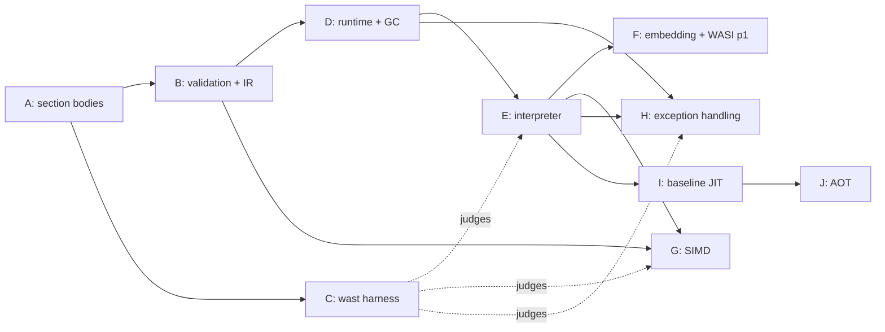

# Roadmap

## Executive Summary

- This file is the honest picture of what exists. Every other doc
  describes shipped behaviour only; anything not shipped is listed here.
- **Shipped:** the binary reader, the type vocabulary, the populated
  module model, the full section-body decoder (Track A), the validator
  and the register IR it emits (Track B, vectors excepted), the `.wast`
  harness front end and its runner over the corpus's binary subset (Track
  C, partial), the runtime state and the precise collector (Track D,
  delivered), and three programs: `wasmlight inspect` / `wasmlight
  validate` and `wasmspec`.
- **Garbage collection has landed (Track D).** It was the longest pole by
  structural reach, not by instruction count: it rewrote the type section,
  added a runtime subtyping check, and put a precise collector under the
  runtime. The remaining reach is what runs on it — the execution tiers.
- **Largest single chunk: SIMD**, at roughly half the instruction set.
  Large but shallow, and almost entirely independent of everything else.
- **No dates.** There is no delivery history to anchor them to (see
  Confidence). Tracks are sized against counted spec surface and ordered
  by dependency.

## Confidence

Sizing here is anchored on the **counted specification surface**, not on
measured throughput, because there is nothing to measure yet: the
repository has no closed issues, no merged pull requests, and no releases.
A throughput-anchored plan needs merged-PR history and issue-to-merge lead
time; neither exists. Tracks A, B, and D landing — and Track C in part —
does not change that: tracks landing outside a pull-request workflow are
not a rate.

That is a real limitation, not a formality. Counts tell you how much
surface there is, not how fast this project crosses it. **Re-anchor this
roadmap once there is merged-PR history**, and treat any calendar estimate
made before then as invented.

Spec counts below come from `wasm-mcp` at pinned `spec/main`
`d7b37e4170d8315f2f1283aed4e8076591a9a333`; testsuite counts from
`WebAssembly/testsuite@main`.

## Shipped

| Capability | Where | Verified by |
| --- | --- | --- |
| Bounds-checked byte cursor | `Wasm.Binary` | `Wasm.Binary.Test` |
| LEB128 u32/u64/s32/s64, with width and overlong rejection | `Wasm.Binary` | `Wasm.Binary.Test` |
| Value/heap/reference type model (3.0 composite reftypes) | `Wasm.Core` | `Wasm.Core.Test` |
| Section ids and their prescribed order | `Wasm.Core` | `Wasm.Core.Test` |
| Module preamble + section walk | `Wasm.Decoder` | `Wasm.Decoder.Test` |
| Section ordering, extent, and custom-name rules | `Wasm.Decoder` | `Wasm.Decoder.Test` |
| Decoded module model with section lookup | `Wasm.Module` | `Wasm.Decoder.Test` |
| UTF-8 validation of names (a decode rule) | `Wasm.Binary` | `Wasm.Binary.Test` |
| `s33` reader for heap types and block types | `Wasm.Binary` | `Wasm.Binary.Test` |
| Section body decoding, all 13 known sections | `Wasm.Decoder` + `Wasm.Decoder.*` | the `Wasm.Decoder.*` suites + `Wasm.Fixtures.Test` |
| 3.0 recursive-type decode (rectype/subtype/comptype) | `Wasm.Decoder.Types` | `Wasm.Decoder.Types.Test` |
| Expression skipper, full 3.0 opcode immediate table | `Wasm.Decoder.Expr` | `Wasm.Decoder.Expr.Test` |
| Cross-section grammar checks (function/code, data count) | `Wasm.Decoder` | `Wasm.Decoder.Test` |
| Populated module model with index-space counts | `Wasm.Module` | `Wasm.Module.Test` |
| Type-section validity, rec-group canonicalisation, the matching relation | `Wasm.Validator.Types` | `Wasm.Validator.Types.Test` |
| Constant-expression validation and its lowered init expressions | `Wasm.Validator.Const` | `Wasm.Validator.Const.Test` |
| Fused body walk — decode, type-check, and IR emission in one pass, including GC, exception handling, and tail calls | `Wasm.Validator.Body` | `Wasm.Validator.Body.Test` |
| Register-based IR: instruction encoding, aux blocks, safepoints, handler tables, disassembler | `Wasm.Ir` | `Wasm.Ir.Test` |
| Module-level validation, phase order, and IR assembly (`ValidateModule`) | `Wasm.Validator` | `Wasm.Validator.Test` + `Wasm.Fixtures.Test` |
| Untagged runtime value slot and reference encoding | `Wasm.Runtime.Values` | `Wasm.Runtime.Values.Test` |
| Trap vocabulary, fault attribution, and the per-invocation trampoline | `Wasm.Runtime.Traps` | `Wasm.Runtime.Traps.Test` |
| Linear memory and the one access chokepoint (ADR-0013 strategy matrix) | `Wasm.Runtime.Memory` | `Wasm.Runtime.Memory.Test` |
| Engine canonical type table, store, instances, runtime subtyping | `Wasm.Runtime.Store` | `Wasm.Runtime.Store.Test` |
| Constant-expression evaluation and the instantiation sequence | `Wasm.Runtime.Instantiate` | `Wasm.Runtime.Instantiate.Test` (incl. fixture instantiation) |
| Precise, non-moving, stop-the-world mark-sweep collector | `Wasm.Runtime.Gc` | `Wasm.Runtime.Gc.Test` |
| `.wast` lexer, s-expression parser, command classifier | `Wasm.Wast` | `Wasm.Wast.Test` |
| `.wast` runner: binary subset judged (malformed / invalid / top-level module) | `Wasm.Wast.Runner` | `Wasm.Wast.Runner.Test` + the corpus |
| Cross-check against 22 real compiled modules | `tests/fixtures/` | `Wasm.Fixtures.Test` |
| `wasmlight inspect` (sections + entity counts) | `source/apps/wasmlight.pas` | `Wasm.Fixtures.Test` + manual |
| `wasmlight validate` (decode + validate, reporting the lowered IR) | `source/apps/wasmlight.pas` | `Wasm.Fixtures.Test` + manual |
| `wasmspec` (runs the corpus's binary subset) | `source/apps/wasmspec.pas` | `Wasm.Wast.Runner.Test` + the corpus |
| Decoder and LEB128 benchmarks | `source/apps/wasmbench.pas` | measurement only |

Everything below is **Absent** unless marked otherwise. Tracks A, B, and D
are delivered; one delivery is partial: Track C's runner judges the
corpus's binary subset, but the text-format assembler and the
execution-tier assertions are absent. Track B's caveat stands — it walks
every non-vector instruction the 3.0 draft defines, with the `$FD` space
staged to Track G.

## The counted backlog

**497 instructions**, by category. Version split overall: 1.0 = 170,
2.0 = 265, 3.0 = 62. 77 can trap.

| Category | Count | By version |
| --- | ---: | --- |
| `vec` | 234 | 2.0: 214, 3.0: 20 |
| `numeric` | 140 | 1.0: 127, 2.0: 13 |
| `memory` | 51 | 1.0: 25, 2.0: 26 |
| `control` | 22 | 1.0: 11, 3.0: 11 |
| `array` | 14 | 3.0: 14 |
| `ref` | 9 | 2.0: 3, 3.0: 6 |
| `table` | 8 | 2.0: 8 |
| `struct` | 6 | 3.0: 6 |
| `variable` | 5 | 1.0: 5 |
| `parametric` | 3 | 1.0: 2, 2.0: 1 |
| `i31` | 3 | 3.0: 3 |
| `extern` | 2 | 3.0: 2 |

Three counting traps worth knowing before sizing anything from this table:

- **`memory` is not 51 memory instructions.** 25 are the 1.0 load/store
  ops and 4 are bulk memory; the other 22 are the `v128.load*` /
  `v128.store*` family. Budget those with SIMD. Real SIMD surface is
  ~256 instructions, over half the instruction set.
- **`numeric` is 91% 1.0.** The 13 2.0 additions are sign-extension (5)
  and non-trapping float-to-int (8). Cheap.
- **GC is 31 instructions and a subsystem.** Instruction count badly
  understates it — see Track D.

**Conformance corpus:** 288 `.wast` files, 257 of them the 3.0 root
corpus, ~192,500 lines, **~64,100 assertions** — `assert_return` 53,291,
`assert_trap` 5,252, `assert_invalid` 3,009, `assert_malformed` 2,208,
`assert_unlinkable` 262, `assert_exception` 41, `assert_exhaustion` 15.

`assert_return` is 83% of all assertions and is concentrated in the SIMD
files. **Sequence by file, not by assertion count** — passing a majority
of assertions is not passing a majority of features.

## Tracks

Ordered by dependency, not by priority. A track may start when its
prerequisites are complete.

### Track A — Section body decoding — **delivered**

Turned located sections into a populated model: types, imports,
functions, tables, memories, globals, exports, elements, code, data,
tags — the `Wasm.Decoder.Common/Types/Entities/Segments/Expr` units,
verified by their co-located suites and the fixture cross-check.

The type section was **not** a list of function types under 3.0 — it
decodes into a list of *recursive types*, requiring `rectype` (mutually
recursive groups), `subtype` (declared supertypes plus a `final` flag),
and `comptype` (functype | structtype | arraytype) with mutable and
**packed** field types. This was the largest single piece of Track A and
it exists only because of the GC target.

### Track B — Validation and the IR — **delivered, vectors excepted**

The spec's static type check, emitting the register-based IR
([ADR-0007](adr/0007-validation-emits-the-lowered-ir.md),
[ADR-0012](adr/0012-the-ir-is-register-based.md)). It runs once, before
any tier, and it is the only pass that reads the raw binary: the type
section validated incrementally with each rec group canonicalised and
interned, the `valid-rectype` / `valid-comptype` / `valid-heaptype` /
`valid-typeuse` clauses, constant expressions, the module-shape rules in
the phase order `valid-module` fixes, and a fused per-function walk that
decodes, type-checks, and lowers in a single pass — with local
initialization tracking for non-defaultable locals. `Wasm.Ir` holds what
it emits, and `wasmlight validate` is the shipped consumer.

The walk covers the GC (`$FB`) space, exception handling — `try_table`'s
handler ranges and catch clauses are emitted from day one, though nothing
throws until Track H — tail calls, multiple memories, and memory64
address types.

Two honest caveats:

- **Vectors are not validated.** `$FD` typing is Track G's, and the walk
  raises `SIMD validation is not implemented` rather than accepting a
  `v128` instruction it has not checked. That includes `v128.const`,
  which *is* a constant instruction in the spec. `IR_FORMAT_VERSION` is 1
  and bumps to 2 when Track G appends the vector ops.
- **The error-message prefixes are unconfirmed.** The corpus prefix-
  matches failure strings, so the messages are part of conformance rather
  than diagnostics. Where the upstream spelling could not be confirmed
  against the spec text, the source carries an `UNCONFIRMED` marker at the
  site. Track C's runner is what settles them — until it runs, every
  message is our best reading and some will change.

### Track C — Conformance harness (needs A) — **runner delivered over the binary subset; wat assembler and execution pending**

A `.wast` script runner. This is deliberately early: it is the only
external judge the project has, and every later track's claim of
correctness routes through it.

Two slices are delivered. `Wasm.Wast` holds the lexer, s-expression
parser, and top-level command classifier, keeping module payloads as raw
trees so lazy decoding is preserved by construction. `Wasm.Wast.Runner`
then assembles each `(module binary ...)` case and runs it through decode
and validation, judging `assert_malformed`, `assert_invalid`, and
top-level `module`; `wasmspec` (`source/apps/`) points it at the corpus.
Over `WebAssembly/testsuite@main` that is `pass=1034 fail=35 staged=6`
with `errors=0` — 1,075 judged commands (`pass + fail + staged`), the
`(module binary ...)` cases the runner reached. See [testing.md](testing.md) and
[`tests/spec/README.md`](../tests/spec/README.md) for the tallies and the
failure breakdown.

Track B is why this became useful without an execution tier:
`assert_malformed` (2,208) and `assert_invalid` (3,009) exercise decode
and validation alone, and running them is what settled the
decode/validation-reachable `UNCONFIRMED` message prefixes (see Track B).

What is still absent is the rest of Track C:

- **The text-format assembler.** `(module ...)` and `(module quote ...)`
  cases are skipped for want of a `.wat` → bytes assembler, and that is the
  bulk of the skipped corpus. The design is written up at
  `.agent/design/wat-assembler.md`, and it is the path to the rest of
  Track C.
- **Execution-tier assertions.** `register`, `invoke`, `assert_return`,
  `assert_trap`, and the rest need a tier (Track E) and are skipped until
  one exists.

Requirements the corpus imposes, and where each stands:

- **Lazy decoding — met.** `(module quote ...)` (1,311 occurrences) and
  `(module binary ...)` (1,069) are assembled or decoded at *command
  execution* time, not script-parse time — otherwise `assert_malformed`
  cannot observe the failure it exists to observe.
- **Prefix-matched failure strings — met for the binary subset.** The
  reference interpreter checks that the expected string is a *prefix* of
  the actual message. Our error messages are therefore part of
  conformance, not just diagnostics.
- **NaN classes.** `nan:canonical` (3,283) and `nan:arithmetic` (3,391)
  rule out bitwise float comparison — once `assert_return` is judged.
- **`(either ...)` results** (32) for implementation-defined relaxed-SIMD
  outcomes.
- **Host references**: `(ref.extern n)` (140) and `(ref.host n)`.
- **Testsuite-local directives** `assert_malformed_custom` and
  `assert_invalid_custom` are not in the reference grammar; the runner
  classifies them as unknown and skips them.

Watch for runner timeouts on the outliers: two SIMD files are 11,676
lines each.

### Track D — Runtime state and the collector (needs B) — **delivered**

The store, instances, memories, tables, and globals; the value
representation; the memory chokepoint; the trap path
([ADR-0009](adr/0009-traps-unwind-to-a-per-invocation-trampoline.md));
instantiation; and the precise collector
([ADR-0011](adr/0011-precise-gc-from-ir-derived-stack-maps.md)) — all below
the tier seam, none of it executing a guest instruction yet.

Delivered, unit by unit:

- **Value representation** — the 8-byte untagged slot, references
  discovered from `RefRegBits` rather than a tag (`Wasm.Runtime.Values`).
- **Store and instances** — the engine-wide canonical type table that
  re-interns each module's rolled rec-group keys, plus a **runtime
  subtyping check** behind `ref.test` / `ref.cast` / `br_on_cast*`; three
  disjoint heap-type hierarchies (func, aggregate, extern) modelled
  exactly (`Wasm.Runtime.Store`).
- **The memory chokepoint** — one access path, the strategy chosen
  statically per memory by the ADR-0013 matrix (guard pages, guard-assisted
  checks, or explicit checks), every route trapping identically
  ([ADR-0013](adr/0013-i64-memories-take-guard-assisted-bounds-checks.md),
  `Wasm.Runtime.Memory`).
- **The trap path** — fault attribution and the per-invocation trampoline
  (`Wasm.Runtime.Traps`).
- **Instantiation** — the constant-expression evaluator and the
  `aux-rundata` allocation order, raising `EWasmLinkError` before any
  mutation on a bad import (`Wasm.Runtime.Instantiate`).
- **Precise mark-sweep GC** — non-moving, stop-the-world, triggered at
  allocation sites, with runtime subtyping and the IR-derived frame walk
  keeping exactly the flagged registers (`Wasm.Runtime.Gc`).

Verified by the `Wasm.Runtime.*` suites, fixture instantiation, and the
corpus's binary subset. GC's 31 instructions were always the small part;
the subsystem around them was the work.

### Track E — Interpreter tier (needs B, D — both done) — **critical-path next step**

The tier of record and the reference the other tiers are differentially
tested against. With Track D delivered its prerequisites are met, so it is
the next step on the critical path. It consumes the IR, Track D's store,
and the GC's frame-walk contract — no re-derived rule, no second read of
the binary. Carries the epoch check
([ADR-0006](adr/0006-epoch-interruption-not-fuel.md)) and stack-map
production from the start, because retrofitting either is the expensive
version.

### Track F — Embedding API and WASI preview1 (needs E)

`Wasm.Engine`, `wasmlight run`, and the deny-by-default capability set.
The v1 host surface is WASI preview1 only
([ADR-0014](adr/0014-the-component-model-is-deferred-to-post-v1.md)).

### Track G — SIMD (B done; needs E for execution) — **largest chunk, most parallel**

~256 instructions counting the `v128` load/store family. Almost entirely
independent of GC, EH, and the host surface, and internally uniform — the
best candidate for parallel work, and the one whose progress is least
informative about the rest of the project.

**Vector validation is staged here, not in Track B.** The body walk and
the constant-expression checker both reach the `$FD` space and both raise
`SIMD validation is not implemented` at it, so the surface is already
enumerated and the failure is loud rather than silent. Track G's first
obligation is therefore typing plus IR lowering for these instructions,
which appends to `TWasmIrOp` and bumps `IR_FORMAT_VERSION` to 2;
execution follows and needs E. `tests/fixtures/valid/simd.wasm` asserts
the staged message today, so it is the first thing that fails when the
work starts.

### Track H — Exception handling (B done; needs D, E)

Tag section (id 13, already recognised by the decoder), `syntax-tagtype`,
tag and exception instances in the store, and an **exception-handler
stack** alongside labels and frames. The static half is done: Track B
validates `try_table` and its catch clauses and emits the IR's handler
ranges, resolved targets, and payload registers. What is absent is the
dynamic half — throwing, matching a handler, and unwinding to it. That is
a second unwinding mechanism next to the trap path, which is why ADR-0009
says wasm exceptions need their own route through the trampoline rather
than reusing the trap one.

The legacy `try` / `catch` / `delegate` / `rethrow` encoding is **not** in
3.0 — it lives in `testsuite/legacy/` and is out of scope.

### Track I — Baseline JIT (needs E, plus F/G/H for coverage)

x86-64 and aarch64. Inherits three obligations from decisions already
taken: emit the epoch check at every back-edge, produce a stack map at
every safepoint, and keep live references discoverable by the collector —
which constrains register allocation.

### Track J — Ahead-of-time compiler and artifact cache (needs I)

Artifacts record the IR version they were compiled from and are rejected
on mismatch.

## Dependency shape

The critical path is **A → B → D → E**; A, B, and D are behind it, so E is
next. Everything expensive that is not on the path — SIMD especially — can
proceed in parallel.

## Constraints discovered from the spec

Recorded here because each one invalidates an obvious implementation
choice, and finding out later is expensive.

- **Tail calls forbid a host-stack-recursive interpreter.** `return_call`,
  `return_call_indirect`, and `return_call_ref` require frame
  *replacement* with guaranteed O(1) stack growth. An interpreter that
  recurses the Pascal call stack per wasm call cannot be conformant. This
  constrains Track E's frame representation from its first line, and it
  is also what would make a future stack-switching proposal tractable.
- **memory64 is in 3.0, and it strains guard pages.** A 64-bit-addressed
  memory cannot be covered by a 4 GiB reservation, so the guard-page
  strategy in [ADR-0005](adr/0005-guard-page-linear-memory.md) does not
  reach it. The strategy split is therefore not only host bitness but
  also per-memory address type — settled in
  [ADR-0013](adr/0013-i64-memories-take-guard-assisted-bounds-checks.md).
- **Multiple memories are in 3.0.** Every memory instruction carries a
  memory index immediate where 1.0 had a reserved zero byte. Decoders that
  assert `0x00` are wrong; ours must not learn that habit in Track A.
- **memory64 makes address type pervasive.** `syntax-addrtype`
  parameterises every memory *and table* access, plus `limits`, over
  i32/i64. This is a refactor of the memory and table layer, not an
  additive feature — build Track D's memory layer parameterised from the
  start.
- **Relaxed SIMD results are implementation-defined** within a documented
  set, which is why the corpus needs `(either ...)`. These 20 instructions
  cannot be tested by exact comparison.

## Settled questions

Both questions this roadmap used to carry as open are now decided; the
arguments live in the ADRs, not here.

1. **How does guard-page memory reach memory64?** Settled by
   [ADR-0013](adr/0013-i64-memories-take-guard-assisted-bounds-checks.md):
   the access strategy is selected statically per memory by address
   type. i32 memories keep guard pages on 64-bit hosts and explicit
   checks on 32-bit ones; i64 memories always carry an explicit bounds
   check — guard-assisted on 64-bit hosts, so static offsets fold into
   an offset-independent compare, and plain checks with index-width
   reduction on 32-bit hosts. All of it stays behind the single memory
   chokepoint, and every route traps identically.
2. **Is the Component Model still a v1 goal?** No. Settled by
   [ADR-0014](adr/0014-the-component-model-is-deferred-to-post-v1.md),
   which supersedes the component half of ADR-0002: the Component Model
   is post-v1, the v1 host surface is WASI preview1 only, and the
   deny-by-default capability model carries forward unchanged. The
   re-entry condition is recorded under "After 3.0" below.

## After 3.0

For a non-JS runtime there is exactly one phase-4 proposal not already in
3.0: **threads** (shared memories, the `i32/i64.atomic.*` family,
`memory.atomic.wait/notify`; 4 test files). It is the largest remaining
subsystem after GC, and it collides directly with
[ADR-0008](adr/0008-a-store-is-confined-to-one-thread.md) — adopting it
means revisiting that ADR, not extending it.

The other phase-4 items (JS Promise Integration, Web Content Security
Policy) are JS/web-embedding only and do not apply.

Phase 3 items with test corpora already present: custom descriptors (14
files), custom page sizes (5), wide arithmetic (1). Stack switching is
phase 3 with **no corpus yet**.

The **Component Model** sits here by decision, not oversight
([ADR-0014](adr/0014-the-component-model-is-deferred-to-post-v1.md)).
It re-enters once the announced canonical-ABI rework (lazy lowering)
has landed and is covered by the reference WAST suite in
`WebAssembly/component-model/test`. That suite exists now — updating
the older observation that nothing exercised the proposal — but it is
Wasmtime-anchored rather than a neutral conformance bar.

## Not planned

See "What wasmlight is not" in [VISION.md](../VISION.md). That fence is
the durable one; this file only sequences work inside it.

## Known gaps in the toolchain

- **Top-level help is rendered locally.** lwpt's `cli` package hardcodes
  its own tagline in `TSubcommandRegistry.PrintTopLevelHelp` with no
  override, so `wasmlight` prints its own banner and unknown-command path
  while still reading the command list from the live registry. Worth an
  upstream issue against lwpt; the local workaround is documented in
  [AGENTS.md](../AGENTS.md) and in `source/apps/wasmlight.pas`.
