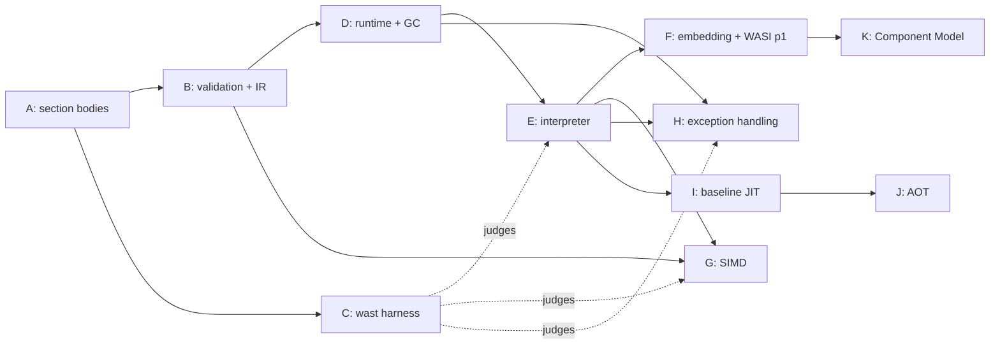

# Roadmap

## Executive Summary

- This file is the honest picture of what exists. Every other doc
  describes shipped behaviour only; anything not shipped is listed here.
- **Shipped:** the binary reader, the type vocabulary, the module model,
  the structural decoder, and `wasmlight inspect`.
- **Longest pole: garbage collection.** Not by instruction count — by
  structural reach. It rewrites the type section, adds a runtime
  subtyping check, and puts a collector under every tier.
- **Largest single chunk: SIMD**, at roughly half the instruction set.
  Large but shallow, and almost entirely independent of everything else.
- **No dates.** There is no delivery history to anchor them to (see
  Confidence). Tracks are sized against counted spec surface and ordered
  by dependency.

## Confidence

Sizing here is anchored on the **counted specification surface**, not on
measured throughput, because there is nothing to measure yet: the
repository has one commit, no closed issues, no merged pull requests, and
no releases. A throughput-anchored plan needs merged-PR history and
issue-to-merge lead time; neither exists.

That is a real limitation, not a formality. Counts tell you how much
surface there is, not how fast this project crosses it. **Re-anchor this
roadmap once there is merged-PR history**, and treat any calendar estimate
made before then as invented.

Spec counts below come from `wasm-mcp` at pinned `spec/main`
`d7b37e4170d8315f2f1283aed4e8076591a9a333`; testsuite counts from
`WebAssembly/testsuite@main`.

## Shipped

| Capability | Where | Verified by |
| --- | --- | --- |
| Bounds-checked byte cursor | `Wasm.Binary` | `Wasm.Binary.Test` |
| LEB128 u32/u64/s32/s64, with width and overlong rejection | `Wasm.Binary` | `Wasm.Binary.Test` |
| Value/heap/reference type model (3.0 composite reftypes) | `Wasm.Core` | `Wasm.Core.Test` |
| Section ids and their prescribed order | `Wasm.Core` | `Wasm.Core.Test` |
| Module preamble + section walk | `Wasm.Decoder` | `Wasm.Decoder.Test` |
| Section ordering, extent, and custom-name rules | `Wasm.Decoder` | `Wasm.Decoder.Test` |
| Decoded module model with section lookup | `Wasm.Module` | `Wasm.Decoder.Test` |
| UTF-8 validation of names (a decode rule) | `Wasm.Binary` | `Wasm.Binary.Test` |
| `s33` reader for heap types and block types | `Wasm.Binary` | `Wasm.Binary.Test` |
| Cross-check against 22 real compiled modules | `tests/fixtures/` | `Wasm.Fixtures.Test` |
| `wasmlight inspect` | `source/apps/wasmlight.pas` | `Wasm.Fixtures.Test` + manual |
| Decoder and LEB128 benchmarks | `source/apps/wasmbench.pas` | measurement only |

Everything below is **Absent** unless marked otherwise. Nothing is
partially delivered.

## The counted backlog

**497 instructions**, by category. Version split overall: 1.0 = 170,
2.0 = 265, 3.0 = 62. 77 can trap.

| Category | Count | By version |
| --- | ---: | --- |
| `vec` | 234 | 2.0: 214, 3.0: 20 |
| `numeric` | 140 | 1.0: 127, 2.0: 13 |
| `memory` | 51 | 1.0: 25, 2.0: 26 |
| `control` | 22 | 1.0: 11, 3.0: 11 |
| `array` | 14 | 3.0: 14 |
| `ref` | 9 | 2.0: 3, 3.0: 6 |
| `table` | 8 | 2.0: 8 |
| `struct` | 6 | 3.0: 6 |
| `variable` | 5 | 1.0: 5 |
| `parametric` | 3 | 1.0: 2, 2.0: 1 |
| `i31` | 3 | 3.0: 3 |
| `extern` | 2 | 3.0: 2 |

Three counting traps worth knowing before sizing anything from this table:

- **`memory` is not 51 memory instructions.** 25 are the 1.0 load/store
  ops and 4 are bulk memory; the other 22 are the `v128.load*` /
  `v128.store*` family. Budget those with SIMD. Real SIMD surface is
  ~256 instructions, over half the instruction set.
- **`numeric` is 91% 1.0.** The 13 2.0 additions are sign-extension (5)
  and non-trapping float-to-int (8). Cheap.
- **GC is 31 instructions and a subsystem.** Instruction count badly
  understates it — see Track D.

**Conformance corpus:** 288 `.wast` files, 257 of them the 3.0 root
corpus, ~192,500 lines, **~64,100 assertions** — `assert_return` 53,291,
`assert_trap` 5,252, `assert_invalid` 3,009, `assert_malformed` 2,208,
`assert_unlinkable` 262, `assert_exception` 41, `assert_exhaustion` 15.

`assert_return` is 83% of all assertions and is concentrated in the SIMD
files. **Sequence by file, not by assertion count** — passing a majority
of assertions is not passing a majority of features.

## Tracks

Ordered by dependency, not by priority. A track may start when its
prerequisites are complete.

### Track A — Section body decoding (no prerequisites)

Turn located sections into a populated model: types, imports, functions,
tables, memories, globals, exports, elements, code, data, tags.

The type section is **not** a list of function types under 3.0 — it
decodes into a list of *recursive types*, requiring `rectype` (mutually
recursive groups), `subtype` (declared supertypes plus a `final` flag),
and `comptype` (functype | structtype | arraytype) with mutable and
**packed** field types. This is the largest single piece of Track A and it
exists only because of the GC target.

### Track B — Validation and the IR (needs A)

The spec's static type check, emitting the register-based IR
([ADR-0007](adr/0007-validation-emits-the-lowered-ir.md),
[ADR-0012](adr/0012-the-ir-is-register-based.md)). Includes the
`valid-rectype` / `valid-comptype` / `valid-heaptype` / `valid-typeuse`
clauses and null-tracking for non-nullable reference types.

### Track C — Conformance harness (needs A; grows with every later track)

A `.wast` script runner. This is deliberately early: it is the only
external judge the project has, and every later track's claim of
correctness routes through it. Requirements the corpus imposes, none
optional:

- **Lazy decoding.** `(module quote ...)` (1,311 occurrences) and
  `(module binary ...)` (1,069) must be parsed or decoded at *command
  execution* time, not script-parse time — otherwise `assert_malformed`
  cannot observe the failure it exists to observe.
- **Prefix-matched failure strings.** The reference interpreter checks
  that the expected string is a *prefix* of the actual message. Our error
  messages are therefore part of conformance, not just diagnostics.
- **NaN classes.** `nan:canonical` (3,283) and `nan:arithmetic` (3,391)
  rule out bitwise float comparison.
- **`(either ...)` results** (32) for implementation-defined relaxed-SIMD
  outcomes.
- **Host references**: `(ref.extern n)` (140) and `(ref.host n)`.
- **Testsuite-local directives** `assert_malformed_custom` and
  `assert_invalid_custom` are not in the reference grammar; the parser
  must not choke on them.

Watch for runner timeouts on the outliers: two SIMD files are 11,676
lines each.

### Track D — Runtime state and the collector (needs B) — **longest pole**

Store, instances, memories, tables, globals, the trap path
([ADR-0009](adr/0009-traps-unwind-to-a-per-invocation-trampoline.md)),
and the precise collector
([ADR-0011](adr/0011-precise-gc-from-ir-derived-stack-maps.md)).

GC's 31 instructions are the small part. The obligations are: aggregate
instances in the store, an allocator with tracing and reclamation,
canonicalisation of recursive types, and a **runtime subtyping check**
behind `ref.test` / `ref.cast` / `br_on_cast*`. Three disjoint heap-type
hierarchies (func, aggregate, extern) have to be modelled exactly.

### Track E — Interpreter tier (needs B, D)

The tier of record and the reference the other tiers are differentially
tested against. Carries the epoch check
([ADR-0006](adr/0006-epoch-interruption-not-fuel.md)) and stack-map
production from the start, because retrofitting either is the expensive
version.

### Track F — Embedding API and WASI preview1 (needs E)

`Wasm.Engine`, `wasmlight run`, and the deny-by-default capability set
([ADR-0002](adr/0002-wasi-p1-and-component-model.md)).

### Track G — SIMD (needs B, E) — **largest chunk, most parallel**

~256 instructions counting the `v128` load/store family. Almost entirely
independent of GC, EH, and the host surface, and internally uniform — the
best candidate for parallel work, and the one whose progress is least
informative about the rest of the project.

### Track H — Exception handling (needs B, D, E)

Tag section (id 13, already recognised by the decoder), `syntax-tagtype`,
tag and exception instances in the store, and an **exception-handler
stack** alongside labels and frames. A second unwinding mechanism next to
the trap path, which is why ADR-0009 says wasm exceptions need their own
route through the trampoline rather than reusing the trap one.

The legacy `try` / `catch` / `delegate` / `rethrow` encoding is **not** in
3.0 — it lives in `testsuite/legacy/` and is out of scope.

### Track I — Baseline JIT (needs E, plus F/G/H for coverage)

x86-64 and aarch64. Inherits three obligations from decisions already
taken: emit the epoch check at every back-edge, produce a stack map at
every safepoint, and keep live references discoverable by the collector —
which constrains register allocation.

### Track J — Ahead-of-time compiler and artifact cache (needs I)

Artifacts record the IR version they were compiled from and are rejected
on mismatch.

### Track K — Component Model (needs F) — see the open question below

Component decoding and canonical ABI lowering.

## Dependency shape

The critical path is **A → B → D → E**. Everything expensive that is not
on it — SIMD especially — can proceed in parallel once B lands.

## Constraints discovered from the spec

Recorded here because each one invalidates an obvious implementation
choice, and finding out later is expensive.

- **Tail calls forbid a host-stack-recursive interpreter.** `return_call`,
  `return_call_indirect`, and `return_call_ref` require frame
  *replacement* with guaranteed O(1) stack growth. An interpreter that
  recurses the Pascal call stack per wasm call cannot be conformant. This
  constrains Track E's frame representation from its first line, and it
  is also what would make a future stack-switching proposal tractable.
- **memory64 is in 3.0, and it strains guard pages.** A 64-bit-addressed
  memory cannot be covered by a 4 GiB reservation, so the guard-page
  strategy in [ADR-0005](adr/0005-guard-page-linear-memory.md) does not
  reach it. The strategy split is therefore not only host bitness — see
  the open question below.
- **Multiple memories are in 3.0.** Every memory instruction carries a
  memory index immediate where 1.0 had a reserved zero byte. Decoders that
  assert `0x00` are wrong; ours must not learn that habit in Track A.
- **memory64 makes address type pervasive.** `syntax-addrtype`
  parameterises every memory *and table* access, plus `limits`, over
  i32/i64. This is a refactor of the memory and table layer, not an
  additive feature — build Track D's memory layer parameterised from the
  start.
- **Relaxed SIMD results are implementation-defined** within a documented
  set, which is why the corpus needs `(either ...)`. These 20 instructions
  cannot be tested by exact comparison.

## Open questions

1. **How does guard-page memory reach memory64?** Options: explicit
   bounds checks for any i64-addressed memory (a third path alongside
   64-bit guard pages and 32-bit checks); or dynamic-bound checks with a
   reserved region sized to the declared maximum where one exists. This
   changes ADR-0005's consequences and should be settled before Track D
   builds the memory layer.
2. **Is the Component Model still a v1 goal?**
   [ADR-0002](adr/0002-wasi-p1-and-component-model.md) puts it in v1
   scope, but the evidence has moved: it is a **phase 1** proposal with an
   empty `affected_specs`, specified out-of-band in
   `WebAssembly/component-model`, and **nothing in the core testsuite
   exercises it**. So it is both less settled and less verifiable than
   ADR-0002 assumed — it would need its own conformance story built from
   scratch. Worth re-deciding, and if it moves, ADR-0002 should be
   superseded rather than quietly reinterpreted.

## After 3.0

For a non-JS runtime there is exactly one phase-4 proposal not already in
3.0: **threads** (shared memories, the `i32/i64.atomic.*` family,
`memory.atomic.wait/notify`; 4 test files). It is the largest remaining
subsystem after GC, and it collides directly with
[ADR-0008](adr/0008-a-store-is-confined-to-one-thread.md) — adopting it
means revisiting that ADR, not extending it.

The other phase-4 items (JS Promise Integration, Web Content Security
Policy) are JS/web-embedding only and do not apply.

Phase 3 items with test corpora already present: custom descriptors (14
files), custom page sizes (5), wide arithmetic (1). Stack switching is
phase 3 with **no corpus yet**.

## Not planned

See "What wasmlight is not" in [VISION.md](../VISION.md). That fence is
the durable one; this file only sequences work inside it.

## Known gaps in the toolchain

- **Top-level help is rendered locally.** lwpt's `cli` package hardcodes
  its own tagline in `TSubcommandRegistry.PrintTopLevelHelp` with no
  override, so `wasmlight` prints its own banner and unknown-command path
  while still reading the command list from the live registry. Worth an
  upstream issue against lwpt; the local workaround is documented in
  [AGENTS.md](../AGENTS.md) and in `source/apps/wasmlight.pas`.
