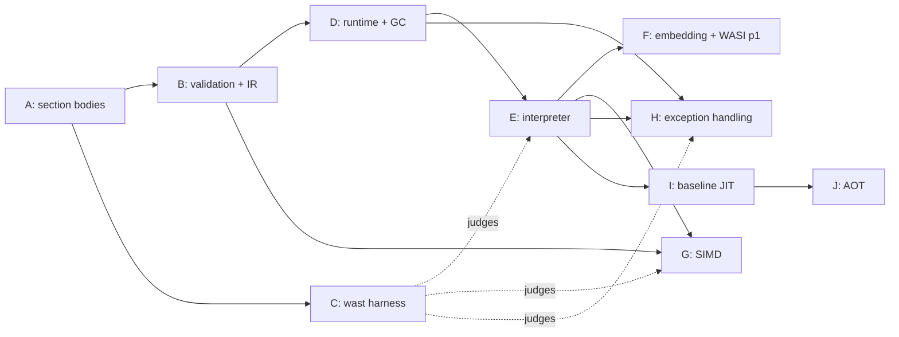

# Roadmap

## Executive Summary

- This file is the honest picture of what exists. Every other doc
  describes shipped behaviour only; anything not shipped is listed here.
- **Shipped:** the binary reader, the type vocabulary, the populated
  module model, the full section-body decoder (Track A), the validator
  and the register IR it emits (Track B), the runtime state and the
  precise collector (Track D), the interpreter tier that executes the IR
  (Track E), the full `v128` vector instruction set — decoded, validated,
  executed, assembled from text, and conformance-tested (Track G) —
  exception handling — `throw` / `throw_ref` / `try_table` executed, tags
  and exception objects in the store, conformance-judged (Track H) — and
  the conformance harness now substantially complete (Track C): the
  `.wast` front end, the wat text-format assembler, and a runner that
  assembles text modules and *executes* `assert_return` / `assert_trap` /
  `invoke` / `assert_exhaustion` / `assert_exception` through the
  interpreter over the whole corpus. And now the embedding API and the
  host surface (Track F): `Wasm.Engine` — the Pascal host's load / link /
  instantiate / call / memory facade — the `Wasm.Wasi.*` WASI preview1
  host module, and `wasmlight run`, which runs a real WASI command to a
  process exit code under a deny-by-default capability set. Three programs
  drive it: `wasmlight` (with `inspect` / `validate` / `run`), `wasmspec`,
  and `wasmbench`.
- **The core is complete, and the runtime now runs real programs.** With
  Track H the runtime decodes, validates, instantiates, and **executes all
  of core wasm 3.0** — every category in the counted backlog, SIMD and
  exception handling included. Nothing in the interpreter is staged any
  more: the harness's `STAGED` column is **0**. The 257 pinned core scripts
  run at **65,188 pass, 0 fail, 0 skip** with `errors=0`. With Track
  F that execution core is now reachable from a host and from the command
  line: `wasmlight run tests/fixtures/wasi/hello.wasm` prints `hello` and
  exits `0`, and a program granted a preopen reads the filesystem through
  it — the runtime does not merely execute every instruction, it **runs
  WASI preview1 programs**, hello-world through filesystem-via-preopens.
  That execution core now runs behind **three interchangeable tiers**, not
  one (see the tier bullet below); there is no remaining roadmap track.
- **Garbage collection has landed (Track D).** It was the longest pole by
  structural reach, not by instruction count: it rewrote the type section,
  added a runtime subtyping check, and put a precise collector under the
  runtime. The remaining reach is what runs on it — the execution tiers.
- **SIMD has landed (Track G).** It was the largest single chunk — roughly
  half the instruction set — but large and shallow, and almost entirely
  independent of everything else, which is what made it the most parallel
  work in the plan. `v128` now runs the whole pipeline: typing and IR
  lowering (`IR_FORMAT_VERSION` is now 2), a dedicated interpreter leaf
  unit, the assembler's vector text forms, GC `v128` struct/array fields,
  and per-lane conformance judging.
- **Exception handling has landed (Track H).** The last staged execution
  feature. `throw` / `throw_ref` / `try_table` execute by an explicit
  unwind over the interpreter's activation stack — no `longjmp`, matching
  each frame's handler table by tag store-address; an uncaught throw
  becomes `EWasmException`, a sibling of `EWasmTrap` reaching the
  trampoline on its own route ([ADR-0009](adr/0009-traps-unwind-to-a-per-invocation-trampoline.md)).
  Exception objects are GC objects with a traced payload, and
  `assert_exception` is judged. `IR_FORMAT_VERSION` stays **2** — the
  handler tables were in the IR from day one.
- **The performance tiers have landed (Tracks I and J).** The runtime now
  executes behind **three interchangeable, observationally-identical
  execution tiers**: the interpreter (the tier of record, on every
  platform), a **baseline JIT** that compiles each function to native code
  at run time, and an **ahead-of-time compiler** that compiles to a
  `.waot` artifact loaded for instant startup. All three produce
  **byte-identical** pinned-core results (65,188 pass, no failures or skips)
  on both aarch64 and
  x86-64. The JIT and AOT share **two backends** — `Wasm.Jit.Arm64` and
  `Wasm.Jit.X64` — gated to a 64-bit UNIX host (`WASM_JIT_EXEC`); on
  Windows and 32-bit targets the JIT/AOT are inactive and the runtime is
  **interpreter-only**, which is fully conformant (the interpreter is the
  tier of record) but unaccelerated. AOT always re-decodes and
  re-validates the module: the artifact is a per-module perf cache bound
  by hash, never a trust bypass. **There is no remaining roadmap track** —
  the critical path *and* the performance tiers are complete.
- **What honestly remains is not a v1 track.** Three things. First, broader
  optimizing-compiler work beyond the shipped, measured fast paths: more
  general register allocation and native lowering, plus optimizations such as
  inlining, loop-invariant code motion, and global value numbering. The
  current compiling tiers already inline scalar memory, lower exact scalar
  numeric and integer-SIMD subsets, allocate hot loop values, and fuse safe
  compare/branch and move sequences. They also retain helper-free numeric loop
  values and expression temporaries across epoch-only back-edges, sparsely
  initialize compiled frames from validation metadata, streamline resolved
  direct-call frame entry/exit, and pin eligible single-memory state in the
  aarch64 backend. Second, the 368 recursively measured failures, all confined
  to proposals or the out-of-scope legacy encoding (see Track C). Third,
  operational runtime facilities and post-Core-3 standards work. Exact-main
  CI has now passed all six configured targets; the four 64-bit UNIX legs
  proved interpreter/JIT/AOT tally identity and the Windows legs proved the
  interpreter.
- **Next sequence:** release `0.1.0`, then complete and govern the embedding
  surface (`0.2.0`), independently judge and finish non-network WASI Preview 1
  (`0.3.0`), and add operational observability (`0.4.0`). The source-verified
  comparison, accepted decisions, and sizing evidence are in the
  [2026-08-15 roadmap review](../ROADMAP-260815.md).
- **No dates.** Seven merged pull requests provide an initial delivery sample,
  but the observed rate varies too widely to support a calendar commitment.
  Releases remain ordered by dependency and exit criteria.

## Confidence

The original A-J plan was anchored on counted specification surface because
the repository had no pull-request delivery history. It now has seven merged
pull requests, but still no issue-created-to-merge sample and no release
cadence. The observed rates range from 0.54 pull requests per week over 90 days
to 17.3 during the short active burst; PR-open-to-merge time omits most
investigation and implementation. Those data support bounded sequencing, not
dates. Re-anchor after four issue-linked roadmap pull requests have merged.

The current throughput calculations, source-level peer comparison, and
confidence limits are recorded in the
[2026-08-15 roadmap review](../ROADMAP-260815.md).

Spec counts below come from `wasm-mcp` at pinned `spec/main`
`d7b37e4170d8315f2f1283aed4e8076591a9a333`; testsuite counts from
`WebAssembly/testsuite@main`.

## Shipped

| Capability | Where | Verified by |
| --- | --- | --- |
| Bounds-checked byte cursor | `Wasm.Binary` | `Wasm.Binary.Test` |
| LEB128 u32/u64/s32/s64, with width and overlong rejection | `Wasm.Binary` | `Wasm.Binary.Test` |
| Value/heap/reference type model (3.0 composite reftypes) | `Wasm.Core` | `Wasm.Core.Test` |
| Section ids and their prescribed order | `Wasm.Core` | `Wasm.Core.Test` |
| Module preamble + section walk | `Wasm.Decoder` | `Wasm.Decoder.Test` |
| Section ordering, extent, and custom-name rules | `Wasm.Decoder` | `Wasm.Decoder.Test` |
| Decoded module model with section lookup | `Wasm.Module` | `Wasm.Decoder.Test` |
| UTF-8 validation of names (a decode rule) | `Wasm.Binary` | `Wasm.Binary.Test` |
| `s33` reader for heap types and block types | `Wasm.Binary` | `Wasm.Binary.Test` |
| Section body decoding, all 13 known sections | `Wasm.Decoder` + `Wasm.Decoder.*` | the `Wasm.Decoder.*` suites + `Wasm.Fixtures.Test` |
| 3.0 recursive-type decode (rectype/subtype/comptype) | `Wasm.Decoder.Types` | `Wasm.Decoder.Types.Test` |
| Expression skipper, full 3.0 opcode immediate table | `Wasm.Decoder.Expr` | `Wasm.Decoder.Expr.Test` |
| Cross-section grammar checks (function/code, data count) | `Wasm.Decoder` | `Wasm.Decoder.Test` |
| Populated module model with index-space counts | `Wasm.Module` | `Wasm.Module.Test` |
| Type-section validity, rec-group canonicalisation, the matching relation | `Wasm.Validator.Types` | `Wasm.Validator.Types.Test` |
| Constant-expression validation and its lowered init expressions | `Wasm.Validator.Const` | `Wasm.Validator.Const.Test` |
| Fused body walk — decode, type-check, and IR emission in one pass, including GC, exception handling, and tail calls | `Wasm.Validator.Body` | `Wasm.Validator.Body.Test` |
| Register-based IR: instruction encoding, aux blocks, safepoints, handler tables, disassembler | `Wasm.Ir` | `Wasm.Ir.Test` |
| Module-level validation, phase order, and IR assembly (`ValidateModule`) | `Wasm.Validator` | `Wasm.Validator.Test` + `Wasm.Fixtures.Test` |
| Untagged runtime value slot and reference encoding | `Wasm.Runtime.Values` | `Wasm.Runtime.Values.Test` |
| Trap vocabulary, fault attribution, and the per-invocation trampoline | `Wasm.Runtime.Traps` | `Wasm.Runtime.Traps.Test` |
| Linear memory and the one access chokepoint (ADR-0013 strategy matrix) | `Wasm.Runtime.Memory` | `Wasm.Runtime.Memory.Test` |
| Engine canonical type table, store, instances, runtime subtyping | `Wasm.Runtime.Store` | `Wasm.Runtime.Store.Test` |
| Constant-expression evaluation and the instantiation sequence | `Wasm.Runtime.Instantiate` | `Wasm.Runtime.Instantiate.Test` (incl. fixture instantiation) |
| Precise, non-moving, stop-the-world mark-sweep collector | `Wasm.Runtime.Gc` | `Wasm.Runtime.Gc.Test` |
| Interpreter tier: explicit-frame dispatch over the register IR, tail-call frame replacement, epoch check, stack maps | `Wasm.Interp` | `Wasm.Interp.Test` |
| Baseline JIT tier: per-function native codegen over the IR behind the seam, two backends (aarch64 / x86-64), byte-identical to the interpreter | `Wasm.Jit` (+ `Wasm.Jit.CodeBuffer`, `Wasm.Jit.Arm64`, `Wasm.Jit.X64`) | `Wasm.Jit.Test` + `Wasm.Jit.CodeBuffer.Test` + `Wasm.Jit.Arm64.Test` + `Wasm.Jit.X64.Test` + the `--tier=jit` corpus |
| AOT tier: compile ahead of time to a `.waot` artifact (arch + ABI + module-hash guarded), re-validate and load for instant startup, fall back to interpret on any mismatch | `Wasm.Aot` (+ `Wasm.Aot.Artifact`) | `Wasm.Aot.Test` + `Wasm.Aot.Artifact.Test` + the `--tier=aot` corpus |
| Exception handling: `throw` / `throw_ref` / `try_table` executed by explicit activation-stack unwind, tag store-address matching, `EWasmException` for an uncaught throw | `Wasm.Interp` | `Wasm.Interp.Test` |
| Exception objects (`exn`): GC-managed, tag address plus a traced payload | `Wasm.Runtime.Gc` + `Wasm.Runtime.Store` | `Wasm.Runtime.Gc.Test` + `Wasm.Runtime.Store.Test` |
| Bit-exact numeric operators (integer, float, conversions, NaN classes) | `Wasm.Interp.Numeric` | `Wasm.Interp.Numeric.Test` |
| Bit-exact `v128` vector operators — every lane shape, saturating/narrowing, per-lane NaN discipline, relaxed SIMD (deterministic profile R=0) | `Wasm.Interp.Vector` | `Wasm.Interp.Vector.Test` |
| `v128` typing and IR lowering, incl. `v128.const` as a constant instruction | `Wasm.Validator.Body` + `Wasm.Validator.Const` | `Wasm.Validator.Body.Test` + `Wasm.Validator.Const.Test` |
| wat numeric-literal parser (integer + hex/dec float text → exact bits) | `Wasm.Wat.Numbers` | `Wasm.Wat.Numbers.Test` |
| wat strict tokenizer (classified keyword/reserved/id/number/string) | `Wasm.Wat.Lexer` | `Wasm.Wat.Lexer.Test` |
| Binary emitter: canonical LEB128, type/limits/composite encoders, section backpatching | `Wasm.Wat.Emit` | `Wasm.Wat.Emit.Test` |
| Mnemonic table: every non-vector opcode, its immediate shape, natural alignment | `Wasm.Wat.Opcodes` | `Wasm.Wat.Opcodes.Test` |
| Identifier/label resolution across the twelve index contexts, implicit-typeuse dedup | `Wasm.Wat.Names` | `Wasm.Wat.Names.Test` |
| wat assembler: module text and `(module quote …)` → bytes into DecodeModule → ValidateModule | `Wasm.Wat.Assembler` | `Wasm.Wat.Assembler.Test` |
| `.wast` lexer, s-expression parser, command classifier | `Wasm.Wast` | `Wasm.Wast.Test` |
| `.wast` argument/result value parser and matcher (hex floats, NaN classes, references, per-lane `v128` comparison, the relaxed `(either …)` form) | `Wasm.Wast.Values` | `Wasm.Wast.Values.Test` |
| `.wast` runner: assembles text modules, decodes, validates, instantiates, and *executes* assertions through the interpreter | `Wasm.Wast.Runner` | `Wasm.Wast.Runner.Test` + the corpus |
| Embedding API: load / link / instantiate / call, guest memory read/write through the chokepoint, host-root registration (contract HOST-1), the typed host-import linker, `EWasmExit` for a clean guest-requested exit | `Wasm.Engine` | `Wasm.Engine.Test` |
| WASI preview1 host module: args/environ, clock, a real-CSPRNG `random_get`, stdio, and the wave-2 filesystem behind preopen containment — deny-by-default, no ambient authority | `Wasm.Wasi` (+ `Wasm.Wasi.Types`, `Wasm.Wasi.Memory`) | `Wasm.Wasi.Test` (+ `Wasm.Wasi.Types.Test`, `Wasm.Wasi.Memory.Test`) |
| `wasmlight run`: decode + validate a WASI command, link it deny-by-default, run `_start`, map the outcome to a process exit code (`run --aot <artifact.waot>` loads an AOT artifact for instant startup, `--no-aot` forces interpret) | `Wasm.Run` + `source/apps/wasmlight.pas` | `Wasm.Run.Test` + manual |
| `wasmlight aot`: compile a module ahead of time to a `.waot` artifact | `Wasm.Aot` + `source/apps/wasmlight.pas` | `Wasm.Aot.Test` + manual |
| Cross-check against 22 real compiled modules | `tests/fixtures/` | `Wasm.Fixtures.Test` |
| `wasmlight inspect` (sections + entity counts) | `source/apps/wasmlight.pas` | `Wasm.Fixtures.Test` + manual |
| `wasmlight validate` (decode + validate, reporting the lowered IR) | `source/apps/wasmlight.pas` | `Wasm.Fixtures.Test` + manual |
| `wasmspec` (judges the corpus: ~65,592 commands assembled, decoded, validated, and executed, SIMD and exception handling included; `--tier=interp\|jit\|aot` runs each execution tier over the same corpus) | `source/apps/wasmspec.pas` | `Wasm.Wast.Runner.Test` + the corpus |
| Decoder and LEB128 benchmarks | `source/apps/wasmbench.pas` | measurement only |

**Every track A–J is delivered.** The interpreter executes the whole 3.0
instruction set, including the `$FD` vector space and exception-handling
throwing; the embedding API and WASI preview1 host surface (Track F) run
that core as real programs; and the baseline JIT (Track I) and AOT
(Track J) add two more execution tiers behind the one seam, byte-identical
to the interpreter on both arches. Nothing in v1 is Absent or staged. What
is listed further below under "After 3.0" and "Not planned" is future work
*beyond* v1, not a gap inside it.

## The counted backlog

**497 instructions**, by category. Version split overall: 1.0 = 170,
2.0 = 265, 3.0 = 62. 77 can trap.

| Category | Count | By version |
| --- | ---: | --- |
| `vec` | 234 | 2.0: 214, 3.0: 20 |
| `numeric` | 140 | 1.0: 127, 2.0: 13 |
| `memory` | 51 | 1.0: 25, 2.0: 26 |
| `control` | 22 | 1.0: 11, 3.0: 11 |
| `array` | 14 | 3.0: 14 |
| `ref` | 9 | 2.0: 3, 3.0: 6 |
| `table` | 8 | 2.0: 8 |
| `struct` | 6 | 3.0: 6 |
| `variable` | 5 | 1.0: 5 |
| `parametric` | 3 | 1.0: 2, 2.0: 1 |
| `i31` | 3 | 3.0: 3 |
| `extern` | 2 | 3.0: 2 |

Three counting traps worth knowing before sizing anything from this table:

- **`memory` is not 51 memory instructions.** 25 are the 1.0 load/store
  ops and 4 are bulk memory; the other 22 are the `v128.load*` /
  `v128.store*` family. Budget those with SIMD. Real SIMD surface is
  ~256 instructions, over half the instruction set.
- **`numeric` is 91% 1.0.** The 13 2.0 additions are sign-extension (5)
  and non-trapping float-to-int (8). Cheap.
- **GC is 31 instructions and a subsystem.** Instruction count badly
  understates it — see Track D.

**Conformance corpus:** 288 `.wast` files, 257 of them the 3.0 root
corpus, ~192,500 lines, **~64,100 assertions** — `assert_return` 53,291,
`assert_trap` 5,252, `assert_invalid` 3,009, `assert_malformed` 2,208,
`assert_unlinkable` 262, `assert_exception` 41, `assert_exhaustion` 15.

`assert_return` is 83% of all assertions and is concentrated in the SIMD
files. **Sequence by file, not by assertion count** — passing a majority
of assertions is not passing a majority of features.

## Tracks

Ordered by dependency, not by priority. A track may start when its
prerequisites are complete.

### Track A — Section body decoding — **delivered**

Turned located sections into a populated model: types, imports,
functions, tables, memories, globals, exports, elements, code, data,
tags — the `Wasm.Decoder.Common/Types/Entities/Segments/Expr` units,
verified by their co-located suites and the fixture cross-check.

The type section was **not** a list of function types under 3.0 — it
decodes into a list of *recursive types*, requiring `rectype` (mutually
recursive groups), `subtype` (declared supertypes plus a `final` flag),
and `comptype` (functype | structtype | arraytype) with mutable and
**packed** field types. This was the largest single piece of Track A and
it exists only because of the GC target.

### Track B — Validation and the IR — **delivered**

The spec's static type check, emitting the register-based IR
([ADR-0007](adr/0007-validation-emits-the-lowered-ir.md),
[ADR-0012](adr/0012-the-ir-is-register-based.md)). It runs once, before
any tier, and it is the only pass that reads the raw binary: the type
section validated incrementally with each rec group canonicalised and
interned, the `valid-rectype` / `valid-comptype` / `valid-heaptype` /
`valid-typeuse` clauses, constant expressions, the module-shape rules in
the phase order `valid-module` fixes, and a fused per-function walk that
decodes, type-checks, and lowers in a single pass — with local
initialization tracking for non-defaultable locals. `Wasm.Ir` holds what
it emits, and `wasmlight validate` is the shipped consumer.

The walk covers the GC (`$FB`) space, the `$FD` vector space (Track G),
exception handling — `try_table`'s handler ranges and catch clauses were
emitted from day one, and Track H now executes the throwing they describe
— tail calls, multiple memories, and memory64 address types.
`IR_FORMAT_VERSION` is 2:
it was 1 for the non-vector IR and bumped when Track G appended the
vector ops.

One honest caveat remains (the vector one is closed — see Track G):

- **The error-message prefixes are unconfirmed.** The corpus prefix-
  matches failure strings, so the messages are part of conformance rather
  than diagnostics. Where the upstream spelling could not be confirmed
  against the spec text, the source carries an `UNCONFIRMED` marker at the
  site. Track C's runner is what settles them — until it runs, every
  message is our best reading and some will change.

### Track C — Conformance harness (needs A) — **delivered**

A `.wast` script runner. This was deliberately early: it is the only
external judge the project has, and every later track's claim of
correctness routes through it. It is now substantially complete — the wat
text-format assembler landed, and with the interpreter (Track E) wired in
the runner assembles, decodes, validates, instantiates, and *executes*.

The pieces. `Wasm.Wast` is the front end — lexer, s-expression parser,
and top-level command classifier — keeping module payloads as raw trees
so lazy decoding is preserved by construction, and `Wasm.Wast.Values`
parses assertion arguments and expected results (hex floats, NaN classes,
reference matchers, per-lane `v128` comparison, the relaxed `(either …)`
form). The six `Wasm.Wat.*` units are the assembler that lowers module
text and `(module quote ...)` to bytes — vector text forms included —
which re-enter the same shipped
`DecodeModule → ValidateModule → instantiate → interpret` path a binary
module takes. `Wasm.Wast.Runner` turns each command into a verdict:
top-level modules assemble/decode/validate/instantiate, `assert_malformed`
and `assert_invalid` judge the rejection (text operands via
`EWasmTextError` from the assembler, binary via `EWasmDecodeError`), and
`assert_return` / `assert_trap` / `invoke` / `assert_exhaustion` *run*
through the interpreter and compare. `wasmspec` (`source/apps/`) points it
at the corpus.

Over the 257 pinned core scripts that is `pass=65188 fail=0 skip=0
staged=0` with `errors=0`. The recursive mirror adds custom, legacy, and
post-3.0 proposal trees and reports `pass=65851 fail=368 skip=904 staged=0`
across 288 files: `ROOT pass=65208 fail=14 skip=90` and
`PROPOSALS pass=643 fail=354 skip=814`. Judged recursive commands
(`pass + fail`) are **66,219** of 67,123.
The `staged` column is **0**: Track H shipped the throwing that used to
sit there. `--tier=jit` and `--tier=aot` produce the **same** tally,
byte-for-byte (locally, `compiled=8703` for the pinned core and 8,799 for the
recursive mirror on aarch64), which is the
differential proof the two compiling tiers demand
([ADR-0001](adr/0001-tiered-execution-seam.md)). See
[testing.md](testing.md) and
[`tests/spec/README.md`](../tests/spec/README.md) for the tallies and the
failure breakdown.

The 368 recursive failures are **not** 3.0-core gaps. `PROPOSALS`
accounts for 354 of them — post-3.0 features outside the pinned target
([ADR-0004](adr/0004-conformance-target-is-the-3-0-draft.md)):
custom-descriptors, custom-page-sizes, wide-arithmetic, and threads, as
false rejections (`expected=""`) or wording mismatches. The 14 root failures
are all the legacy `try`/`catch`/`delegate`/`rethrow` encoding
(`testsuite/legacy/`, out of 3.0 scope — the 3.0 `try_table` form passes).
The pinned core has no failures or skips.

Requirements the corpus imposes, and where each stands:

- **Lazy decoding — met.** `(module quote ...)` (1,311 occurrences) and
  `(module binary ...)` (1,069) are assembled or decoded at *command
  execution* time, not script-parse time — otherwise `assert_malformed`
  cannot observe the failure it exists to observe.
- **Prefix-matched failure strings — met.** The reference interpreter
  checks that the expected string is a *prefix* of the actual message.
  Our error messages are therefore part of conformance, not just
  diagnostics — now across text, decode, validation, and trap messages.
- **NaN classes — met.** `nan:canonical` (3,283) and `nan:arithmetic`
  (3,391) rule out bitwise float comparison, and `assert_return` now
  compares against the class rather than a bit pattern.
- **`(either ...)` results** (32) for implementation-defined relaxed-SIMD
  outcomes — met: the matcher accepts any listed alternative, and the
  interpreter ships the deterministic profile (R=0), so its result is one
  of them by construction.
- **Host references**: `(ref.extern n)` (140) and `(ref.host n)` — the
  identity matchers are in `Wasm.Wast.Values`.
- **Testsuite-local directives** `assert_malformed_custom` and
  `assert_invalid_custom` are not in the reference grammar; the runner
  classifies them as unknown and skips them.

Watch for runner timeouts on the outliers: two SIMD files are 11,676
lines each.

### Track D — Runtime state and the collector (needs B) — **delivered**

The store, instances, memories, tables, and globals; the value
representation; the memory chokepoint; the trap path
([ADR-0009](adr/0009-traps-unwind-to-a-per-invocation-trampoline.md));
instantiation; and the precise collector
([ADR-0011](adr/0011-precise-gc-from-ir-derived-stack-maps.md)) — all below
the tier seam, none of it executing a guest instruction yet.

Delivered, unit by unit:

- **Value representation** — the 8-byte untagged slot, references
  discovered from `RefRegBits` rather than a tag (`Wasm.Runtime.Values`).
- **Store and instances** — the engine-wide canonical type table that
  re-interns each module's rolled rec-group keys, plus a **runtime
  subtyping check** behind `ref.test` / `ref.cast` / `br_on_cast*`; three
  disjoint heap-type hierarchies (func, aggregate, extern) modelled
  exactly (`Wasm.Runtime.Store`).
- **The memory chokepoint** — one access path, the strategy chosen
  statically per memory by the ADR-0013 matrix (guard pages, guard-assisted
  checks, or explicit checks), every route trapping identically
  ([ADR-0013](adr/0013-i64-memories-take-guard-assisted-bounds-checks.md),
  `Wasm.Runtime.Memory`).
- **The trap path** — fault attribution and the per-invocation trampoline
  (`Wasm.Runtime.Traps`).
- **Instantiation** — the constant-expression evaluator and the
  `aux-rundata` allocation order, raising `EWasmLinkError` before any
  mutation on a bad import (`Wasm.Runtime.Instantiate`).
- **Precise mark-sweep GC** — non-moving, stop-the-world, triggered at
  allocation sites, with runtime subtyping and the IR-derived frame walk
  keeping exactly the flagged registers (`Wasm.Runtime.Gc`).

Verified by the `Wasm.Runtime.*` suites, fixture instantiation, and the
corpus, which now instantiates and runs modules against it. GC's 31
instructions were always the small part;
the subsystem around them was the work.

### Track E — Interpreter tier (needs B, D) — **delivered**

The tier of record and the reference the other tiers will be
differentially tested against. It consumes the IR, Track D's store, and
the GC's frame-walk contract — no re-derived rule, no second read of the
binary. `Wasm.Interp` is the dispatch loop and `Wasm.Interp.Numeric` the
bit-exact numeric leaf functions, with `Wasm.Interp.Vector` the vector
leaf unit added by Track G. The activation stack is explicit — no Pascal
recursion per wasm call — so `return_call` replaces the top frame in place
with O(1) stack growth, as the tail-call rule demands. It carries the
epoch check
([ADR-0006](adr/0006-epoch-interruption-not-fuel.md)) and stack-map
production from the start, because retrofitting either is the expensive
version. It runs the corpus's `assert_return` / `assert_trap` /
`assert_exhaustion` / `assert_exception` cases through Track C — `$FD`
vector execution and exception-handling throwing (Track H) included.

### Track F — Embedding API and WASI preview1 (needs E) — **delivered**

The runtime is now reachable from a Pascal host and from the command line,
and it runs real WASI preview1 programs. The v1 host surface is WASI
preview1 only
([ADR-0014](adr/0014-the-component-model-is-deferred-to-post-v1.md)); the
Component Model stays out.

- **The embedding API (`Wasm.Engine`).** A facade over the shipped
  runtime, adding no runtime logic of its own: load (decode + validate,
  keeping `EWasmDecodeError` and `EWasmValidationError` distinct), link
  through a typed host-import builder (`TWasmLinker` — an import the host
  did not define is simply absent, so instantiation fails with
  `EWasmLinkError`; there is no ambient fallback), instantiate, call, and
  read/write guest memory through the one chokepoint. It also re-exports
  the collector's host-root registration for contract HOST-1, so a host
  holding a reference across an allocation roots it. `EWasmExit` — a clean,
  guest-requested exit, a sibling under `EWasmError`, distinct from a trap
  and from a wasm exception — is declared here.
- **WASI preview1 (`Wasm.Wasi.*`).** A host module wired entirely over
  `Wasm.Engine`. Wave-1 (args/environ, clock, `random_get`, stdio,
  `proc_exit`, `sched_yield`) and wave-2 (`path_open` and the filesystem
  file ops) are defined and run; `random_get` fills from the platform
  CSPRNG (`/dev/urandom` on POSIX, `RtlGenRandom` on Windows), not a PRNG.
  The capability model is **deny-by-default**: a bare config grants stdio +
  clock + random and nothing else — no environment, no filesystem, argv
  only as set. **Preopened directories are the only route to the
  filesystem**, and every filesystem path is contained to the preopen it
  derives from — an absolute path, a `..` escape, or an escaping symlink is
  `ENOTCAPABLE`, rejected before any real OS call. The clock, entropy, and
  filesystem seams are injectable, which is what makes the host module
  hermetically testable.
- **`wasmlight run` (`Wasm.Run` + the CLI).** `wasmlight run [--dir
  GUEST=HOST]... [--env KEY=VALUE]... <module.wasm> [args...]` decodes and
  validates a WASI command module, links it against the granted surface,
  runs `_start`, and maps the outcome to a process exit code — normal
  return → 0, `proc_exit(n)` (`EWasmExit`) → `n`, a trap → 134, an uncaught
  wasm exception → 1, a decode/validate/link failure → 1. `--dir` and
  `--env` add exactly the preopens and variables named and nothing else.
  The driver is factored out of the program entry point into `Wasm.Run` so
  it is hermetically unit-testable with injected streams.

Honest scope. This is preview1 **command** modules (`_start`): a reactor's
`_initialize`-only shape is reported, not run. The wave-3 long tail
(`path_link` / `symlink` / `readlink` / `rename`, `fd_advise` /
`allocate` / `sync`, `poll_oneoff`, and the `sock_*` family) is
intentionally **not defined** — a module importing one fails to link, which
is the honest deny-by-default posture rather than a silent stub. The
Component Model is out
([ADR-0014](adr/0014-the-component-model-is-deferred-to-post-v1.md)).

### Track G — SIMD (needs B, E) — **delivered**

~256 instructions counting the `v128` load/store family — the largest
single chunk, roughly half the instruction set. Almost entirely
independent of GC, EH, and the host surface, and internally uniform, which
is what made it the most parallel work in the plan and the one whose
progress was least informative about the rest of the project. It now runs
end to end:

- **Typing and IR lowering.** The body walk and the constant-expression
  checker cover the `$FD` space; `v128.const` is accepted as a constant
  instruction. The vector ops append to `TWasmIrOp`, which bumped
  `IR_FORMAT_VERSION` from 1 to 2.
- **Execution.** `Wasm.Interp.Vector` is the vector leaf unit beside
  `Wasm.Interp.Numeric` — bit-exact `TWasmV128` operators with the
  per-lane NaN discipline, saturating/narrowing arithmetic, and relaxed
  SIMD on the **deterministic profile (R=0)**, so every relaxed op reduces
  to its non-relaxed twin.
- **Value model.** A `v128` occupies **two adjacent 8-byte register
  slots**, low half first, its low slot always even (16-byte aligned).
  This is the shipped choice; it overrode the earlier side-vector sketch
  in the runtime-spec notes. Neither slot is ever a reference, so the GC
  frame walk leaves both clear, and `v128` struct/array fields are traced
  correctly.
- **Text and conformance.** The assembler emits the vector text forms, and
  the harness judges SIMD `assert_return` / `assert_trap` per lane, with
  `nan:canonical` / `nan:arithmetic` classes and the relaxed `(either …)`
  form. `tests/fixtures/valid/simd.wasm`, which used to assert the staged
  message, now decodes and validates.

### Track H — Exception handling (needs D, E) — **delivered**

The last staged execution feature, now shipped: the runtime executes all
of core wasm 3.0. Tag section (id 13, recognised by the decoder since
Track A), `syntax-tagtype`, tag and exception instances in the store, and
the dynamic half Track B's static half was always waiting for.

- **The static half** was already done in Track B: it validates
  `try_table` and its catch clauses and emits the IR's handler ranges,
  resolved targets, and payload registers. `IR_FORMAT_VERSION` did not
  move — the handler tables were in the IR from day one.
- **Throwing** is an **explicit unwind over the interpreter's activation
  stack**, not a `longjmp`: `throw` / `throw_ref` walk frames from the top,
  and at each frame test its handler table. This is a second unwinding
  mechanism next to the trap path, which is why
  [ADR-0009](adr/0009-traps-unwind-to-a-per-invocation-trampoline.md) has
  wasm exceptions take their own route to the trampoline rather than
  reusing the trap one. An uncaught throw becomes `EWasmException` — a
  sibling of `EWasmTrap` under `EWasmError`, never collapsed into it — and
  reaches the trampoline as exactly one raise.
- **Handler matching is by tag store-address**, not by tag type: two
  modules importing the same tag match on the one address, and
  `catch_all` / `catch_all_ref` match unconditionally.
- **Exception objects (`exn`) are GC objects** carrying the tag address
  and a traced payload; `catch_ref` / `catch_all_ref` push the `exnref`
  after the payload, and the collector traces the payload's references.
- **Conformance.** `assert_exception` is judged, and `try_table.wast`,
  `throw.wast`, and `throw_ref.wast` execute — `staged` fell to 0.

The legacy `try` / `catch` / `delegate` / `rethrow` encoding is **not** in
3.0 — it lives in `testsuite/legacy/` and stays out of scope, so those
files stay failing.

### Track I — Baseline JIT (needs E, plus F/G/H for coverage) — **delivered**

A second execution tier behind the seam, in **two backends** —
`Wasm.Jit.Arm64` (aarch64) and `Wasm.Jit.X64` (x86-64) — over a shared
driver (`Wasm.Jit`) and W^X code buffer (`Wasm.Jit.CodeBuffer`). It
compiles each function to native code the first time it runs and honours
the three obligations decisions already fixed: it emits the epoch check at
every back-edge, the compiled frame *is* the interpreter's frame so the
GC's stack map and tail-call handling come for free, and live references
stay discoverable. It carries the full non-EH op set; a function using
`throw` / `throw_ref` or hosting a `try_table` handler is declined and
stays interpreted, and the two tiers interoperate transparently across the
seam. The correctness proof is differential: `--tier=jit` over the corpus
is **byte-identical** to `--tier=interp` — locally `compiled=8703` on
aarch64, `pass=65188 fail=0 skip=0` — with cross-platform identity enforced
in CI.

The tier runs only where `WASM_JIT_EXEC` holds — a **64-bit UNIX host**.
On Windows and 32-bit targets it is inactive and the runtime is
interpreter-only, which is fully conformant (the interpreter is the tier
of record). Post-track optimization work now ships conservative hot-loop
machine-register allocation, scalar memory access inlined according to the
runtime-selected strategy, native scalar-numeric and integer-SIMD subsets,
compare/branch fusion, redundant-move folding, sparse compiled-frame
initialization, epoch-only back-edge register retention for helper-free numeric
loops, four retained aarch64 expression temporaries, resolved direct-call frame
entry/exit, and aarch64 single-memory instance pinning with a narrower stable-
base path for helper-free zero-offset i32 guard-page loops. These remain
performance choices, never correctness requirements; unsupported and delicate
operations continue through the shared exact helpers.

### Track J — Ahead-of-time compiler and artifact cache (needs I) — **delivered**

A third tier: `wasmlight aot <module.wasm> -o <artifact.waot>` compiles
every function ahead of time to position-independent machine code and
serializes it to a `.waot` artifact (`Wasm.Aot`, `Wasm.Aot.Artifact`);
`wasmlight run --aot <artifact.waot> [--] <module.wasm> [args]` — with
sibling `<module>.waot` auto-detect and a `--no-aot` opt-out — loads it in
a fresh process for **instant startup**. It is proven not to be a re-JIT:
the AOT-loaded executable memory is byte-identical to a fresh compile, and
`--tier=aot` over the corpus is byte-identical to both other tiers
(`compiled=8703` on aarch64 for the pinned core). Same 64-bit-UNIX scope as
Track I.

**Security invariant.** AOT **always re-decodes and re-validates** the
module at load. The artifact is a per-module perf cache, **never a trust
bypass**: its code is used only if the artifact's magic, AOT version, IR
version (2), target arch, ABI fingerprint, module hash, and self-checksum
all match the freshly-validated module — any mismatch (stale, wrong module,
wrong arch) is rejected with a distinct reason and the run transparently
falls back to the interpreter, losing only the speedup.

## Dependency shape

**Every track is delivered — A → B → C → D → E → F → G → H → I → J.** The
execution core runs every guest instruction in core wasm 3.0, the
embedding API and WASI preview1 host (F) run that core as real programs,
and the two performance tiers — baseline JIT (I) and AOT (J) — sit behind
the same seam, adding no behaviour and proven byte-identical to the
interpreter (E) on both arches. The performance tiers are a 64-bit-UNIX
acceleration, not a behaviour: on Windows and 32-bit targets only the
interpreter runs, and that is still fully conformant.

## Constraints discovered from the spec

Recorded here because each one invalidates an obvious implementation
choice, and finding out later is expensive.

- **Tail calls forbid a host-stack-recursive interpreter.** `return_call`,
  `return_call_indirect`, and `return_call_ref` require frame
  *replacement* with guaranteed O(1) stack growth. An interpreter that
  recurses the Pascal call stack per wasm call cannot be conformant. This
  constrains Track E's frame representation from its first line, and it
  is also what would make a future stack-switching proposal tractable.
- **memory64 is in 3.0, and it strains guard pages.** A 64-bit-addressed
  memory cannot be covered by a 4 GiB reservation, so the guard-page
  strategy in [ADR-0005](adr/0005-guard-page-linear-memory.md) does not
  reach it. The strategy split is therefore not only host bitness but
  also per-memory address type — settled in
  [ADR-0013](adr/0013-i64-memories-take-guard-assisted-bounds-checks.md).
- **Multiple memories are in 3.0.** Every memory instruction carries a
  memory index immediate where 1.0 had a reserved zero byte. Decoders that
  assert `0x00` are wrong; ours must not learn that habit in Track A.
- **memory64 makes address type pervasive.** `syntax-addrtype`
  parameterises every memory *and table* access, plus `limits`, over
  i32/i64. This is a refactor of the memory and table layer, not an
  additive feature — build Track D's memory layer parameterised from the
  start.
- **Relaxed SIMD results are implementation-defined** within a documented
  set, which is why the corpus needs `(either ...)`. These 20 instructions
  cannot be tested by exact comparison.

## Settled questions

Both questions this roadmap used to carry as open are now decided; the
arguments live in the ADRs, not here.

1. **How does guard-page memory reach memory64?** Settled by
   [ADR-0013](adr/0013-i64-memories-take-guard-assisted-bounds-checks.md):
   the access strategy is selected statically per memory by address
   type. i32 memories keep guard pages on 64-bit hosts and explicit
   checks on 32-bit ones; i64 memories always carry an explicit bounds
   check — guard-assisted on 64-bit hosts, so static offsets fold into
   an offset-independent compare, and plain checks with index-width
   reduction on 32-bit hosts. All of it stays behind the single memory
   chokepoint, and every route traps identically.
2. **Is the Component Model still a v1 goal?** No. Settled by
   [ADR-0014](adr/0014-the-component-model-is-deferred-to-post-v1.md),
   which supersedes the component half of ADR-0002: the Component Model
   is post-v1, the v1 host surface is WASI preview1 only, and the
   deny-by-default capability model carries forward unchanged. The
   re-entry condition is recorded under "After 3.0" below.

## After 3.0

For a non-JS runtime there is exactly one phase-4 proposal not already in
3.0: **threads** (shared memories, the `i32/i64.atomic.*` family,
`memory.atomic.wait/notify`; 4 test files). It is the largest remaining
subsystem after GC, and it collides directly with
[ADR-0008](adr/0008-a-store-is-confined-to-one-thread.md) — adopting it
means revisiting that ADR, not extending it.

The other phase-4 items (JS Promise Integration, Web Content Security
Policy) are JS/web-embedding only and do not apply.

Phase 3 items with test corpora already present: custom descriptors (14
files), custom page sizes (5), wide arithmetic (1). Stack switching is
phase 3 with **no corpus yet**.

The **Component Model** sits here by decision, not oversight
([ADR-0014](adr/0014-the-component-model-is-deferred-to-post-v1.md)).
It re-enters once the announced canonical-ABI rework (lazy lowering)
has landed and is covered by the reference WAST suite in
`WebAssembly/component-model/test`. That suite exists now — updating
the older observation that nothing exercised the proposal — but it is
Wasmtime-anchored rather than a neutral conformance bar.

## Post-v1 version plan

- **`0.1.0`: pinned-Core-3 baseline.** Changelog-first release of the shipped
  runtime; no new runtime behavior.
- **`0.2.0`: complete and governable embedding.** Public table/tag coverage,
  instance composition, resource policy, epoch configuration, and ordinary
  JIT policy.
- **`0.3.0`: independently judged WASI Preview 1.** Wire `wasi-testsuite`, then
  complete the 19 missing non-network functions. Sockets remain a later,
  separately approved capability slice over pre-granted handles.
- **`0.4.0`: operational runtime.** Name-aware guest stacks, profiler maps,
  and structured statistics. Async hosting remains deferred to the Component
  Model re-entry so the runtime designs one suspension mechanism.
- **After `0.4.0`: Components and current WASI.** Re-enter only after a fresh
  ADR proves a reproducible target, independent enough oracle, stable Canonical
  ABI, and deny-by-default capability model. Threads remain a separate,
  demand-led programme because they reverse ADR-0008.

The detailed source evidence, dependency graph, sizing, and accepted decisions
are in the [2026-08-15 roadmap review](../ROADMAP-260815.md).

## Not planned

See "What wasmlight is not" in [VISION.md](../VISION.md). That fence is
the durable one; this file only sequences work inside it.

## Known gaps in the toolchain

- **Top-level help is rendered locally.** lwpt's `cli` package hardcodes
  its own tagline in `TSubcommandRegistry.PrintTopLevelHelp` with no
  override, so `wasmlight` prints its own banner and unknown-command path
  while still reading the command list from the live registry. Worth an
  upstream issue against lwpt; the local workaround is documented in
  [AGENTS.md](../AGENTS.md) and in `source/apps/wasmlight.pas`.
